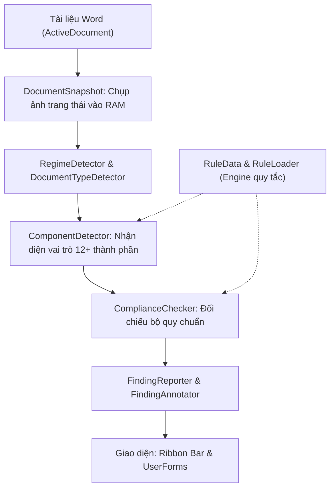

# BÁO CÁO PHÂN TÍCH VÀ ĐỀ XUẤT CẢI TIẾN ADD-IN WORD: CHUẨN HÓA THỂ THỨC

> **Tài liệu gốc**: `ChuanHoaTheThuc.dotm`  
> **Thời gian phân tích**: 01/09/2026  
> **Tổng quy mô**: 68 Modules/Classes/Forms (~1.2 MB VBA Code)

---

## 1. TỔNG QUAN KIẾN TRÚC HỆ THỐNG

Add-in được thiết kế theo mô hình **Pipeline kiến trúc xử lý dữ liệu nhiều lớp (Multi-tier Pipeline)**, đảm bảo tính phân tách trách nhiệm (*Separation of Concerns*) rõ ràng:

---

## 2. PHÂN HỆ CỐT LÕI (CORE SUBSYSTEMS)

### 2.1. Phân hệ Quy tắc & Dữ liệu (Rule Engine)
- **Files chính**: `RuleData.bas` (~711 KB), `RuleLoader.bas`
- **Chức năng**:
  - Lưu trữ bộ quy tắc thể thức theo từng chế độ (**Regime**): `ND30` (Nghị định 30/2020/NĐ-CP), `DANG` (Quy định văn bản Đảng), `VIETTEL` (Quy chế doanh nghiệp).
  - Bảng tra cứu từ điển chính tả tiếng Việt (`mTypoDictionary`), danh sách địa danh hành chính (`mPlaceNames`, `mAdministrativeUnitNames`), quy tắc viết hoa tên cơ quan, quy tắc trích dẫn văn bản quy phạm pháp luật.

### 2.2. Phân hệ Quét & Nhận diện thành phần (Component Detector)
- **Files chính**: `DocumentSnapshot.bas/.cls`, `ComponentDetector.bas` (~1.900 dòng), `DocumentTypeDetector.bas`, `RegimeDetector.bas`
- **Cơ chế hoạt động**:
  - Quét toàn bộ tài liệu thành cấu trúc bộ nhớ `DocumentSnapshot` (chỉ truy cập Word Object Model 1 lần, tránh giật lag màn hình).
  - Áp dụng các đặc trưng nhận diện (Regex, từ khóa tín hiệu, vị trí tương đối) để phân loại từng đoạn văn bản vào 12+ vai trò:
    1. **Quốc hiệu & Tiêu ngữ** (`nationalTitle`, `motto`)
    2. **Tên cơ quan, tổ chức ban hành** (`organName`, `parentOrganName`)
    3. **Số, ký hiệu văn bản** (`codeNumberNotation`)
    4. **Địa danh và ngày tháng năm** (`placeDate`)
    5. **Tên loại & Trích yếu nội dung** (`typeName`, `subject`)
    6. **Nội dung chính** (`bodyText`, Điều, Khoản, Điểm, Căn cứ)
    7. **Chức vụ, họ tên & Chữ ký** (`signPosition`, `signFullName`)
    8. **Nơi nhận** (`recipientsTitle`, `recipientsList`)
    9. **Dấu chỉ mức độ mật, khẩn** (`confidentiality`, `urgency`)
    10. **Ký hiệu người soạn thảo & số lượng** (`authorInitials`, `copyCount`)
    11. **Phụ lục đính kèm** (`appendixTitle`, `appendixBody`)

### 2.3. Phân hệ Kiểm tra tuân thủ (Compliance Checker)
- **Files chính**: `ComplianceChecker.bas` (~220 KB, 182 hàm/thủ tục), `CheckGate.bas`
- **Quy tắc kiểm tra chuyên sâu**:
  - **Trang giấy**: Khổ A4, hướng trang dọc, lề trang theo NĐ30 (Trên/Dưới 20-25mm, Trái 30-35mm, Phải 15-20mm).
  - **Đánh số trang**: Canh giữa đầu trang/chân trang, bắt đầu từ trang 2, cỡ chữ 13-14 thường.
  - **Định dạng đoạn**: Font `Times New Roman`, màu Auto, căn lề 2 bên (Justify), thụt dòng đầu (1.0 - 1.27 cm), giãn dòng (1.15 - 1.5 lines).
  - **Quy cách đường kẻ**: Kẻ dưới Quốc hiệu, Tiêu ngữ, Tên cơ quan, Trích yếu (đúng tỉ lệ 1/3 - 1/2 độ dài).

### 2.4. Phân hệ Chuẩn hóa văn bản & Typography
- **Files chính**:
  - `ToneNormalizer.bas`: Chuẩn hóa vị trí dấu thanh tiếng Việt (kiểu mới `hòa, thúy` vs kiểu cũ `hoà, thuý`).
  - `IyNormalizer.bas`: Chuẩn hóa chính tả `i/y` (kỹ thuật vs kĩ thuật, bác sĩ vs bác sỹ).
  - `EncodingConverter.bas`: Chuyển mã TCVN3 (ABC), VNI sang Unicode dựng sẵn (NFC).
  - `DashNormalizer.bas`: Chuẩn hóa các loại dấu gạch ngang (hyphen, en-dash, em-dash).
  - `MultiSpaceCollapser.bas`, `EdgeWhitespaceTrimmer.bas`, `LineBreakNormalizer.bas`: Dọn sạch khoảng trắng thừa và ngắt dòng mềm `Shift+Enter`.
  - `DecimalSeparatorConverter.bas`: Chuẩn hóa dấu phẩy/chấm số thập phân.
  - `QrCodeGenerator.bas`: Tạo mã QR xác thực văn bản.

---

## 3. ĐÁNH GIÁ ĐIỂM MẠNH & ĐIỂM NGHẼN

### 3.1. Điểm mạnh
- **Tốc độ tối ưu**: Không quét DOM lặp lại nhiều lần.
- **An toàn Unicode**: Dùng `AscW` / `ChrW` xuyên suốt, không bị lỗi font khi xử lý tiếng Việt có dấu.
- **Tính bao quát cao**: Tích hợp gần như toàn diện quy chuẩn thể thức NĐ 30/2020/NĐ-CP và văn bản Đảng.

### 3.2. Điểm nghẽn cần cải tiến
1. **Thiếu tính năng "1-Click Auto-Fix" hoàn chỉnh**: Hiện tại công cụ chủ yếu là phát hiện và báo lỗi; người dùng vẫn phải thao tác thủ công nhiều bước để sửa.
2. **`RuleData.bas` quá nặng (>700 KB hardcoded)**: Việc lưu dữ liệu dạng mảng chuỗi trong code gây khó khăn khi bảo trì, cập nhật từ điển hoặc bổ sung quy định mới.
3. **Xử lý Bảng biểu & Phụ lục chưa thông minh**: Bảng biểu dài tràn trang chưa tự lặp tiêu đề cột (`RepeatHeaderRow`), phụ lục xoay ngang (`Landscape`) dễ làm vỡ số trang.
4. **Giao diện Modal UserForm**: Hộp thoại popup che khuất màn hình Word, không hỗ trợ thao tác dạng Sidebar (Task Pane) trực quan.

---

## 4. LỘ TRÌNH CẢI TIẾN TRỌNG TÂM (ROADMAP)

| Nhóm cải tiến | Giải pháp chi tiết | Độ ưu tiên |
| :--- | :--- | :---: |
| **1. Tính năng Auto-Fix 1-Click** | Thêm nút **"Chuẩn hóa toàn diện"**: Tự động sửa lề, cỡ chữ, font chữ từng thành phần, kẻ đường gạch chuẩn NĐ30, xóa trang trắng thừa chỉ với 1 click. | 🔥 **Rất cao** |
| **2. Tách cấu hình ra file JSON ngoài** | Đưa từ điển, địa danh, quy tắc thể thức ra file `config.json` trong thư mục `%APPDATA%`, cho phép cập nhật từ xa mà không cần build lại file `.dotm`. | 🔥 **Cao** |
| **3. Xử lý Bảng biểu & Phụ lục nâng cao** | - Tự động lặp lại header bảng khi tràn trang. - Tự động căn đều độ rộng cột theo nội dung. - Thêm chức năng tạo Section xoay ngang an toàn không làm nhảy số trang. | **Cao** |
| **4. Cơ chế Hoàn tác An toàn (Safe Undo)** | Lưu Snapshot trước khi chuẩn hóa; hỗ trợ nút "Khôi phục trạng thái ban đầu" an toàn nếu không hài lòng. | **Cao** |
| **5. Kiểm tra ngữ pháp & hành văn** | Bổ sung module nhận diện lỗi hành văn hành chính phổ biến: thiếu chủ ngữ/vị ngữ, lặp từ, dùng sai đại từ nhân xưng, lỗi ngày tháng âm lịch. | **Trung bình** |
| **6. Giao diện Task Pane Sidebar** | Nâng cấp giao diện hiển thị danh sách lỗi sang Task Pane bên phải: click vào lỗi nào thì con trỏ Word tự động nhảy đến đúng dòng đó. | **Rất đáng giá** |

---

## 5. HƯỚNG DẪN BẢO MẬT & QUẢN TRỊ MÃ NGUỒN

1. **Khôi phục bản gốc**: Nếu có sự cố, file dự phòng luôn được lưu tại:  
   `C:\Users\newst\Downloads\Compressed\ChuanHoaTheThuc_backup.dotm`
2. **Mở khóa code VBA**: Đã có file mở khóa sẵn tại:  
   `C:\Users\newst\Downloads\Compressed\ChuanHoaTheThuc_unlocked.dotm`
3. **Mã nguồn giải nén từng module**: Toàn bộ 68 files `.bas`, `.cls`, `.frm` đã được trích xuất sạch sẽ vào:  
   `C:\Users\newst\.gemini\antigravity-ide\scratch\vba_extracted\`

---
*Tài liệu này được biên soạn bởi Antigravity nhằm phục vụ quá trình nâng cấp và tối ưu hóa Add-in.*
