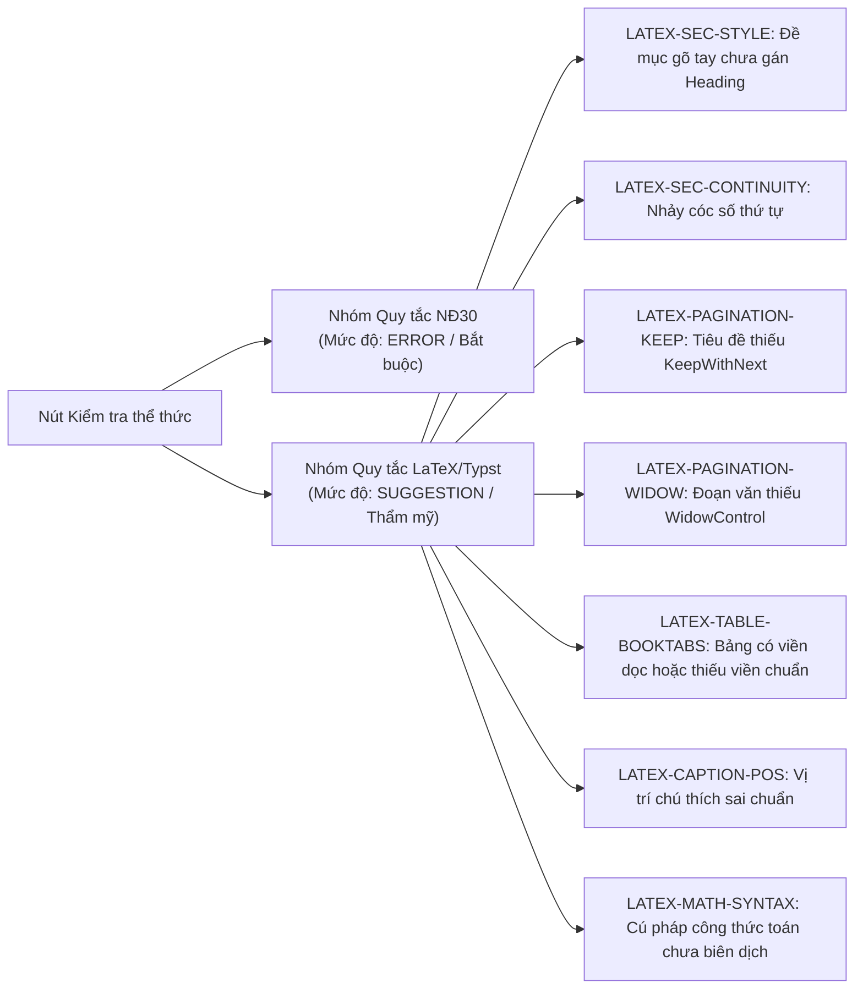

# KẾ HOẠCH TRIỂN KHAI: NÂNG CẤP "KIỂM TRA THỂ THỨC" KẾT HỢP NGHỊ ĐỊNH 30 VÀ CHUẨN XUẤT BẢN LATEX / TYPST

> **Tài liệu tham chiếu dự án**: `ChuanHoa.AddIn.Vsto`
> **Mục tiêu**: Nâng cấp nút **"Kiểm tra thể thức"** và cơ chế quét tài liệu để vừa kiểm tra sự tuân thủ nghiêm ngặt **Nghị định 30/2020/NĐ-CP** (và Hướng dẫn 05-HD/VPTW), vừa áp dụng các tiêu chuẩn kiểm tra & thẩm mỹ xuất bản của **LaTeX/Typst**.
> **Nguyên tắc bất biến**: **Nghị định 30 có tính ưu tiên tối thượng**. Tiêu chuẩn LaTeX bù đắp các khoảng trống về thẩm mỹ chuyên nghiệp (đề mục, bảng biểu `booktabs`, công thức toán, ngắt dòng, chống mồ côi tiêu đề).

---

## 1. MA TRẬN PHÂN CẤP ƯU TIÊN (PRIORITY MATRIX)

Khi một thuộc tính có sự giao thoa hoặc tiềm ẩn xung đột:

| Thành phần văn bản | Ưu tiên | Quy định áp dụng |
| :--- | :--- | :--- |
| **Khổ giấy & Lề trang** | **100% NĐ30** | Khổ A4 đứng. Lề: Trên 20-25mm, Dưới 20-25mm, Trái 30-35mm, Phải 15-20mm. (Bỏ qua cấu hình lề mặc định của LaTeX). |
| **Font chữ chính** | **100% NĐ30** | Bắt buộc `Times New Roman` (Unicode NFC TCVN 6909:2001). Không dùng font TeX (`Latin Modern Roman`) cho văn bản thường. |
| **12 Thành phần thể thức** | **100% NĐ30** | Quốc hiệu, Tiêu ngữ, Tên cơ quan, Số/Ký hiệu, Ngày tháng, Trích yếu, Chức vụ, Chữ ký, Họ tên, Nơi nhận... giữ nguyên 100% quy tắc NĐ30. |
| **Nhận diện đề mục gõ tay** | **LaTeX Engine** | Quét & tự nhận diện cấu trúc phân cấp (1., 1.1, I., Điều 1...) kể cả khi người dùng gõ tay hoàn toàn, chưa gán Style. |
| **Kiểm tra tính liên tục số mục** | **LaTeX Engine** | Phát hiện lỗi nhảy cóc số thứ tự (ví dụ `1.1` $\rightarrow$ `1.3`), trùng số mục, lộn xộn cấp mục. |
| **Ngắt trang chống mồ côi** | **LaTeX Engine** | Bắt buộc tiêu đề mục phải có `KeepWithNext = true` (không bao giờ để tiêu đề rớt lại cuối trang đơn độc). Đoạn văn bật `WidowControl = true`. |
| **Bảng biểu (Tables)** | **Thẩm mỹ LaTeX** | Chuẩn hóa `booktabs`: Bỏ toàn bộ viền dọc thô; viền ngang trên/dưới nét dày (1.0-1.5pt), viền ngăn header nét mảnh (0.5-0.75pt). |
| **Công thức Toán (Math)** | **LaTeX Engine** | Phát hiện cú pháp `$ ... $` hoặc `$$ ... $$` chưa được chuyển đổi sang Equation OMath của Word. |
| **Vị trí Chú thích (Captions)** | **LaTeX Hierarchy** | Chú thích Bảng phải ở TRÊN bảng, Chú thích Hình phải ở DƯỚI hình. |

---

## 2. BỔ SUNG 7 MÃ QUY TẮC KIỂM TRA MỚI (LATEX RULE PACK)

Trong nút **"Kiểm tra thể thức"**, ngoài 82 quy tắc NĐ30 hiện có, bổ sung thêm 7 quy tắc thuộc nhóm `LATEX-*`:



### Chi tiết từng quy tắc mới:
1. **`LATEX-SEC-STYLE` (Đề mục chưa gán Heading Style)**:
   - *Hiện tượng:* Người dùng gõ `1.1. Mục tiêu` nhưng đoạn văn vẫn mang Style `Normal` (văn bản thường), chỉ bôi đậm bằng tay.
   - *Phát hiện:* Dòng khớp regex số mục, ngắn (< 180 ký tự), không kết thúc bằng dấu câu nối tiếp, nhưng `Style != Heading X`.
   - *Gợi ý/Comment:* `[LaTeX] Đề mục cấp 2 gõ tay chưa được gán Style Heading 2. Gán Heading để tự động tạo Mục lục và Bookmarks PDF.`
2. **`LATEX-SEC-CONTINUITY` (Đứt gãy chuỗi số thứ tự)**:
   - *Hiện tượng:* Đang có mục `1.1`, mục `1.2`, mục tiếp theo lại là `1.4` (bị mất `1.3`).
   - *Phát hiện:* Duyệt cây chỉ mục (Heading Tree), so sánh số sau với số trước.
   - *Gợi ý/Comment:* `[LaTeX] Số thứ tự đề mục bị nhảy cóc: mục '1.4' xuất hiện ngay sau '1.2' (thiếu mục 1.3).`
3. **`LATEX-PAGINATION-KEEP` (Chống trôi tiêu đề mục)**:
   - *Hiện tượng:* Tiêu đề mục nằm ở đáy trang, sang trang sau mới là nội dung.
   - *Phát hiện:* Đoạn văn là tiêu đề nhưng thuộc tính `ParagraphFormat.KeepWithNext == 0` (`false`).
   - *Gợi ý/Comment:* `[LaTeX] Tiêu đề mục chưa bật thuộc tính dính liền dòng tiếp theo (Keep with next), có nguy cơ bị rơi xuống cuối trang.`
4. **`LATEX-PAGINATION-WIDOW` (Chống dòng mồ côi)**:
   - *Hiện tượng:* Đoạn văn dài bị ngắt trang để lại đúng 1 dòng trơ trọi ở đầu trang sau hoặc cuối trang trước.
   - *Phát hiện:* Đoạn văn thân bài (`Body`) có `ParagraphFormat.WidowControl == 0` (`false`).
   - *Gợi ý/Comment:* `[LaTeX] Đoạn văn chưa bật kiểm soát dòng mồ côi (Widow/Orphan control).`
5. **`LATEX-TABLE-BOOKTABS` (Bảng biểu chưa tối ưu xuất bản)**:
   - *Hiện tượng:* Bảng có viền lưới dọc bao quanh từng ô, gây nặng nề rối mắt.
   - *Phát hiện:* Đối tượng `Table` có `Borders[wdBorderLeft].LineStyle != wdLineStyleNone` hoặc `Borders[wdBorderVertical].LineStyle != wdLineStyleNone`.
   - *Gợi ý/Comment:* `[LaTeX] Bảng đang sử dụng viền dọc thô. Khuyến nghị bỏ viền dọc và áp dụng chuẩn booktabs để bảng thanh thoát, chuyên nghiệp.`
6. **`LATEX-CAPTION-POS` (Vị trí chú thích Bảng & Hình)**:
   - *Hiện tượng:* Đặt tên bảng bên dưới bảng, hoặc đặt tên hình bên trên hình.
   - *Phát hiện:* Đoạn văn có pattern `Bảng \d+` nằm ngay sau bảng, hoặc `Hình \d+` nằm ngay trước hình.
   - *Gợi ý/Comment:* `[LaTeX] Chú thích Bảng cần đặt ở PHÍA TRÊN bảng (chú thích Hình ảnh đặt ở PHÍA DƯỚI hình).`
7. **`LATEX-MATH-SYNTAX` (Công thức toán học thô)**:
   - *Hiện tượng:* Người dùng gõ cú pháp toán dạng LaTeX `$E = mc^2$` hoặc `$$\int ...$$` nhưng chưa được Word dựng thành công thức.
   - *Phát hiện:* Regex tìm cặp ký tự `$...$` hoặc `$$...$$` trong các đoạn văn.
   - *Gợi ý/Comment:* `[LaTeX] Phát hiện biểu thức toán học dạng mã nguồn LaTeX. Khuyến nghị chuyển đổi sang công thức Word chuẩn.`

---

## 3. THIẾT KẾ KỸ THUẬT & FILE CẦN TÁC ĐỘNG

### A. Tầng Thư viện Core (`src/ChuanHoa.Client.Core/`)

1. **`Scanning/HeadingDetector.cs` (Mới)**:
   - Chứa thuật toán phân tích chuỗi ký tự đầu dòng, bóc tách `HeadingLevel`, `HeadingNumber`, `HeadingTitle`.
   - Lưu trữ `HeadingTree` trong phiên phân tích để kiểm tra tính liên tục (`Continuity`).
2. **`Scanning/LatexTypographicScanner.cs` (Mới)**:
   - Triển khai logic kiểm tra cho 7 quy tắc `LATEX-*`.
   - Trả về danh sách `AnnotationFinding` với mức độ `Severity = Severity.Suggestion` hoặc `Severity.Warning`.
3. **`Scanning/CanonicalRuleScanner.cs` (Chỉnh sửa)**:
   - Bổ sung 7 mã rule mới vào `RegisteredRuleCodes`.
   - Trong phương thức `ScanFormat()`, sau khi kiểm tra xong các rule NĐ30, gọi thêm `LatexTypographicScanner` để bổ sung findings.

### B. Tầng VSTO Add-in (`src/ChuanHoa.AddIn.Vsto/`)

1. **`Runtime/WordDocumentSnapshotBuilder.cs` (Chỉnh sửa)**:
   - Đọc thêm thông tin từ đối tượng Word COM:
     - `paragraph.Format.KeepWithNext`
     - `paragraph.Format.WidowControl`
     - `paragraph.Style` (tên style)
     - `table.Borders` (trạng thái viền dọc, viền ngang)
2. **`Runtime/WordFindingAnnotationAdapter.cs` (Chỉnh sửa)**:
   - Đảm bảo khi tạo comment trong Word:
     - Lỗi NĐ30 hiển thị: `[Nghị định 30] ...`
     - Lỗi LaTeX hiển thị: `[Chuẩn LaTeX/Typst] ...`
3. **`Runtime/RibbonRuntime.cs` (Chỉnh sửa)**:
   - Cập nhật hộp thoại thông báo sau khi quét `btnKiemTra`:
     ```text
     Đã kiểm tra thể thức hoàn toàn tại máy.
     - Vi phạm Thể thức Nghị định 30: X lỗi.
     - Khuyến nghị Thẩm mỹ LaTeX/Typst: Y góp ý.
     - Đề mục phát hiện: Z mục (H1: A, H2: B, H3: C).
     ```
4. **`Runtime/WordOneClickRuntime.cs` (Chỉnh sửa)**:
   - Bổ sung thao tác tự động sửa nhanh cho các lỗi LaTeX khi người dùng chạy Chuẩn hóa 1-Click:
     - Tự động gán Style Heading 1/2/3 cho các đề mục gõ tay.
     - Gán `KeepWithNext = true` cho toàn bộ đề mục.
     - Bật `WidowControl = true` cho toàn bộ đoạn văn.
     - Chuẩn hóa viền bảng thành chuẩn `booktabs`.

### C. Tầng Kiểm thử Tự động (`tests/ChuanHoa.Client.Core.Tests/`)

1. **`Scanning/HeadingDetectorTests.cs` (Mới)**:
   - Kiểm thử nhận diện các dạng số mục: `1. `, `1.1 `, `1.1.1 `, `I. `, `Điều 1. `...
   - Kiểm thử phát hiện lỗi nhảy cóc số: `1.1` $\rightarrow$ `1.3`.
   - Kiểm thử không bắt nhầm danh sách liệt kê có dấu chấm phẩy ở cuối.
2. **`Scanning/LatexTypographicScannerTests.cs` (Mới)**:
   - Kiểm thử quét bảng có viền dọc.
   - Kiểm thử quét tiêu đề thiếu `KeepWithNext`.
   - Kiểm thử bắt cặp ký hiệu toán `$ ... $`.

---

## 4. KẾ HOẠCH BÀN GIAO & CÁC BƯỚC THỰC HIỆN

- [ ] **Giai đoạn 1 (Core Engine)**:
  1. Viết `HeadingDetector.cs` và bộ Unit Test tương ứng.
  2. Viết `LatexTypographicScanner.cs` và tích hợp vào `CanonicalRuleScanner.cs`.
  3. Chạy `dotnet test` đảm bảo pass 100% các test case hiện tại và mới.
- [ ] **Giai đoạn 2 (VSTO Snapshot & Ribbon Integration)**:
  1. Bổ sung trích xuất thuộc tính `KeepWithNext`, `WidowControl`, `Table.Borders` trong `WordDocumentSnapshotBuilder.cs`.
  2. Cập nhật `WordFindingAnnotationAdapter.cs` và thông báo trong `RibbonRuntime.cs`.
- [ ] **Giai đoạn 3 (One-Click Auto-Fix)**:
  1. Thêm tính năng tự động chuyển đổi bảng sang `booktabs` và gán Style Heading tự động trong `WordOneClickRuntime.cs`.
  2. Kiểm thử thực tế trên Word 2010 / 2016 / 2019 / Microsoft 365.
