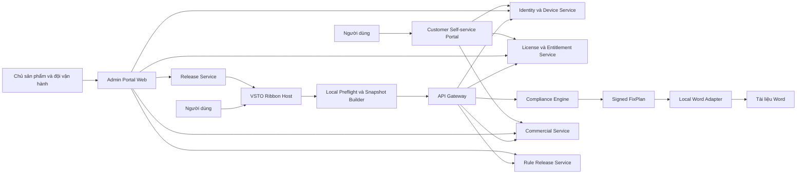

# KẾ HOẠCH TRIỂN KHAI ADD-IN CHUẨN HÓA THỂ THỨC

## VSTO cho Microsoft Word 2010 trở lên, Admin Portal, cập nhật tự động, trial–thương mại và chống can thiệp

| Thuộc tính | Giá trị |
| --- | --- |
| Trạng thái | Kế hoạch chi tiết để phê duyệt trước khi triển khai |
| Ngày lập | 01/09/2026 |
| Phạm vi | Microsoft Word 2010 trở lên trên Windows, Office x86 và x64 |
| Công nghệ client | VSTO/C# trên .NET Framework 4.8 |
| Bề mặt người dùng | Một tab Ribbon, không có task pane thường trực |
| Bề mặt quản trị | Admin Portal web riêng để chủ sản phẩm quản lý ứng dụng, người dùng và thương mại |
| Mô hình xử lý | Word Adapter tại local; engine kiểm tra và FixPlan premium do server cấp |
| Mô hình thương mại | Tài khoản, thiết bị, trial, entitlement, giá và thanh toán do server quản lý |
| Cập nhật | ClickOnce ký số cho khách cá nhân; MSI/Intune cho khách doanh nghiệp |
| Mã nguồn sản phẩm | Chưa sửa trong giai đoạn lập kế hoạch |

---

## 1. Tóm tắt quyết định

### 1.1. Quyết định đã chốt

1. Chỉ phát triển một loại add-in là VSTO.
2. Hỗ trợ Microsoft Word 2010 trở lên trên Windows.
3. Add-in giữ một giao diện duy nhất trên Ribbon, bám sát Ribbon VBA hiện tại.
4. Không phát triển Office Web Add-in trong phạm vi này.
5. Tương tác với Word, đọc cấu trúc tài liệu, áp dụng thay đổi, Undo và backup diễn ra trên máy người dùng.
6. Tài khoản, trial, thiết bị, entitlement, bảng giá, đơn hàng và thanh toán được quản lý trên server.
7. Để bản DLL bị chỉnh sửa hoặc add-in giả không sử dụng được engine chính, các lệnh premium phải nhận `ExecutionGrant` hoặc `FixPlan` có chữ ký từ server.
8. Bản DLL chính thức, application manifest và deployment manifest đều phải được ký số; ClickOnce manifest phải chứa hash của mọi file phát hành.
9. Có hai loại trial nhưng không cộng dồn:
   - Trial ra mắt có thời gian cố định cho toàn hệ thống.
   - Trial cá nhân áp dụng cho tài khoản mới sau khi trial ra mắt kết thúc.
10. Người đã sử dụng trial ra mắt không được nhận thêm trial cá nhân.
11. Giá được quản lý bằng offer có phiên bản và thời gian hiệu lực; giá không được hardcode trong DLL.
12. Quote, đơn hàng, thanh toán và entitlement lịch sử là bất biến, chỉ được chuyển trạng thái theo quy trình được kiểm soát.
13. Có Admin Portal web riêng cho chủ sản phẩm và đội vận hành; portal này không nằm trong Word và không làm phát sinh Ribbon hoặc task pane thứ hai.

### 1.2. Điều cần hiểu đúng về chống crack

Không có phần mềm chạy trên máy người dùng nào chống crack tuyệt đối khi người tấn công có toàn quyền quản trị máy. Mục tiêu bảo vệ của sản phẩm là:

- DLL chính thức bị thay đổi thì chuỗi ClickOnce/VSTO từ chối kích hoạt.
- Manifest bị thay đổi thì chữ ký không còn hợp lệ.
- License bị sao chép sang máy khác thì chữ ký thiết bị không khớp.
- Đổi ngày hệ thống hoặc cài lại add-in không tạo trial mới.
- Add-in giả hoặc DLL đã thay thế không nhận được lease, rule release và FixPlan premium từ server.
- Phiên bản cũ có lỗ hổng có thể bị server bắt buộc cập nhật hoặc thu hồi.

Mục tiêu không phải ngăn một người viết lại các thao tác Word đơn giản như căn giữa đoạn hoặc đổi font. Mục tiêu là bảo vệ sản phẩm chính thức, rule engine, dữ liệu cập nhật, quyền sử dụng và dịch vụ thương mại.

### 1.3. Đánh đổi bắt buộc

| Yêu cầu | Hệ quả kỹ thuật |
| --- | --- |
| Xử lý hoàn toàn local và offline vô hạn | Không thể ngăn tuyệt đối việc bỏ qua kiểm tra license trong DLL |
| DLL sửa hoặc client giả không dùng được engine | Engine premium hoặc dữ liệu bắt buộc phải phụ thuộc server |
| Không gửi nội dung tài liệu ra Internet | Cần lựa chọn engine on-premise hoặc chấp nhận mức chống crack thấp hơn |
| Khóa trial đúng thời điểm | Trial cần kết nối để nhận lease; không có grace vượt quá ngày kết thúc |
| Cập nhật không cần thao tác | Lần cài đầu vẫn cần quyền cài đặt và thiết lập trust hợp lệ |

---

## 2. Hiện trạng làm cơ sở lập kế hoạch

### 2.1. Quy mô đã kiểm kê

- 68 file VBA trong `shared/vba_extracted`.
- Ribbon VBA thật có 1 tab, 7 group, 36 button, 4 menu, 2 dropdown và 3 checkbox.
- 9 file TypeScript nguồn trong backend prototype.
- 13 file thuộc Web Add-in prototype.
- 7 file thuộc VSTO/installer prototype.
- 4 bộ rules và 6 bộ từ điển JSON.
- 25 file tài liệu và script hỗ trợ.

### 2.2. Các sai lệch phải xử lý trước khi port

1. Nút `CHUẨN HÓA TOÀN BỘ` trong bản Ribbon đầy đủ hiện chỉ gọi định dạng trang giấy.
2. Script thử nghiệm thay callback bằng replace toàn cục có thể đổi nhầm cả nút `Định dạng trang giấy`.
3. Hai lệnh kiểm tra VBA hiện thực hiện bảy thao tác sửa tài liệu trước khi quét; hợp đồng mới bắt buộc `Scan` chỉ đọc.
4. Hệ thống đang có bốn con số mâu thuẫn về rule:
   - 96 rule definitions trong `RuleData.bas`; 94 route được đăng ký, trong đó 19 route trỏ tới ba implementation luôn trả `Nothing`, nên chỉ có 75 route có đường logic tại baseline.
   - Tài liệu tuyên bố 82 kiểm tra.
   - JSON thực tế có 52 mã.
   - Backend prototype phát ra khoảng 14 mã duy nhất.
5. Một số dữ liệu JSON bị trích xuất sai, thiếu hoặc làm thay đổi sai tiếng Việt.
6. Lựa chọn loại văn bản thủ công trong VBA chưa thực sự chi phối kết quả kiểm tra và có thể bị auto-detect ghi đè.
7. VSTO prototype không phải project VSTO buildable hoàn chỉnh và chưa sinh được `.vsto`/`.dll.manifest`.
8. Installer prototype chạy `regsvr32` lên managed VSTO DLL, không đúng cơ chế nạp VSTO.
9. Backend prototype chưa có authentication, authorization, persistence, entitlement, webhook verification hoặc audit log.
10. License prototype chấp nhận chuỗi có hình thức giống license thay vì xác minh chữ ký hoặc quyền thật.

### 2.3. Nguyên tắc sử dụng code hiện tại

- VBA là nguồn tham chiếu hành vi và nguồn tạo golden corpus, không được port máy móc từng dòng.
- VSTO hiện tại chỉ là proof-of-concept để tham khảo, không phải nền build phát hành.
- Web Add-in hiện tại không thuộc kiến trúc đích và không được dùng để tuyên bố parity.
- Backend hiện tại chỉ dùng để tham khảo mô hình dữ liệu thử nghiệm; không dùng làm license server production.
- JSON rules và dictionaries hiện tại không được coi là canonical cho đến khi qua quy trình tái tạo, schema validation và legal review.

---

## 3. Mục tiêu, ngoài phạm vi và nguyên tắc sản phẩm

### 3.1. Mục tiêu

1. Một add-in VSTO chạy trên Word 2010 trở lên trên Windows.
2. Một tab Ribbon có đầy đủ chức năng đã được xác nhận từ VBA.
3. Mỗi command có ID ổn định, điều kiện enable, capability, entitlement và acceptance test.
4. Scan không làm thay đổi tài liệu.
5. Mọi mutation có preview, precondition, change log, Undo và rollback phù hợp.
6. Tài liệu không bị mất comments, Track Changes, fields, bookmarks, content controls, header/footer, hình, bảng hoặc section ngoài phạm vi FixPlan.
7. Add-in tự cập nhật sau lần cài ban đầu.
8. Trial, giá và quyền sử dụng có thể thay đổi từ server mà không cần phát hành lại DLL.
9. DLL chính thức bị thay đổi sẽ không vượt qua chuỗi manifest/hash/signature.
10. Client giả không thể nhận engine result premium nếu không có tài khoản, thiết bị và entitlement hợp lệ.
11. Chủ sản phẩm có giao diện web để quản lý user, device, trial, entitlement, giá, thanh toán, phiên bản add-in, rollout, rule release, feature flag, sự cố và audit.

### 3.2. Ngoài phạm vi

- Word trên macOS.
- Word trên Web.
- Word trên iPad hoặc Android.
- Office 2007 và Word 2003.
- Tự động sửa nội dung pháp lý, số tiền, ngày nghiệp vụ, tên cơ quan, chữ ký hoặc con dấu khi mức tin cậy không đủ.
- Cam kết chống crack tuyệt đối trên máy người dùng có toàn quyền quản trị.
- Chạy premium engine vô hạn khi không có kết nối server.

### 3.3. Nguyên tắc an toàn tài liệu

- `Scan` là read-only.
- `PreviewFix` chỉ tạo kế hoạch, không thay đổi Word.
- `ApplyFix` chỉ áp dụng FixPlan đã được xác minh.
- Mỗi operation phải có precondition và kết quả kiểm chứng sau áp dụng.
- Sửa xác định chắc chắn mới được tự động hóa.
- Sửa nội dung nhạy cảm hoặc mơ hồ chỉ được báo lỗi và yêu cầu người dùng quyết định.
- Không xóa comment của người dùng.
- Comment của add-in phải có marker và metadata riêng.
- Không thay đổi thiết lập Word toàn ứng dụng nếu command chỉ nhằm xử lý một tài liệu.
- Không ghi custom document property nếu chưa có mục đích và consent rõ ràng.

---

## 4. Ma trận tương thích

### 4.1. Chính sách phiên bản Word

| Phiên bản Word | Lane | Mục tiêu |
| --- | --- | --- |
| Word 2010 | Legacy compatibility | Chạy được các command trong contract sau khi qua VM test; không tuyên bố còn Microsoft support |
| Word 2013 | Legacy compatibility | Như Word 2010 |
| Word 2016 | Legacy compatibility | Như Word 2010 |
| Word 2019 | Legacy compatibility | Như Word 2010 |
| Office LTSC 2021 | Product support | Đầy đủ theo contract |
| Office LTSC 2024 | Product support | Đầy đủ theo contract |
| Microsoft 365 Apps | Product support | Đầy đủ theo contract trên build được kiểm thử |

### 4.2. Hệ điều hành và bitness

| Hạng mục | Chính sách đề xuất |
| --- | --- |
| Windows 11 x64 | Hỗ trợ chính |
| Windows 10 x64 | Compatibility lane, phụ thuộc chính sách vòng đời của khách hàng |
| Office x86 trên Windows x64 | Bắt buộc kiểm thử và cài đúng registry view |
| Office x64 trên Windows x64 | Bắt buộc kiểm thử |
| Windows 32-bit | Chỉ hỗ trợ nếu còn khách hàng xác nhận; cần VM riêng |
| Windows 7/8/8.1 | Không cam kết product support; chỉ đánh giá theo hợp đồng legacy |

### 4.3. Quy tắc phát triển để giữ tương thích

- Project VSTO được tạo từ template Word VSTO Add-in thật.
- Client target `.NET Framework 4.8`.
- Word/Office Interop dùng API baseline tương thích Word 2010.
- `EmbedInteropTypes=true` cho PIA phù hợp.
- Không gọi API Office mới mà không có capability/version guard.
- Mọi khác biệt Word version được đóng gói trong `IWordCapabilityProvider` và `IWordAdapter`, không rải điều kiện version trong command handler.
- Không dùng WebView2 làm điều kiện bắt buộc cho đăng nhập; dùng system browser và OAuth Authorization Code với PKCE.
- Mọi command không hỗ trợ trên một build cụ thể phải bị disable trước khi chạy và trả lý do rõ ràng.

---

## 5. Kiến trúc đích



### 5.1. Thành phần client

| Thành phần | Trách nhiệm |
| --- | --- |
| `VietDoc.AddIn.Vsto` | Vòng đời VSTO, sự kiện Word, load Ribbon, document/window context |
| `VietDoc.Ribbon` | Ribbon contract, callback, state, invalidation, dialog tạm thời |
| `VietDoc.WordAdapter` | Đọc/ghi Word Object Model, StoryRanges, sections, tables, images, headers/footers |
| `VietDoc.Snapshot` | Tạo snapshot có version và document fingerprint |
| `VietDoc.FixApplier` | Kiểm tra chữ ký, precondition, apply, verify, Undo và rollback |
| `VietDoc.Security.Client` | OAuth/PKCE, device key, lease cache, execution grant, secure storage |
| `VietDoc.Update.Client` | Release channel, minimum version, update status và health marker |
| `VietDoc.Contracts` | DTO sinh từ OpenAPI/JSON Schema, không chứa rule engine premium |

### 5.2. Thành phần server

| Thành phần | Trách nhiệm |
| --- | --- |
| Identity Service | User, identity provider, session, account state |
| Device Service | Đăng ký public key, giới hạn thiết bị, revoke, challenge-response |
| Entitlement Service | Trial, purchase grant, feature entitlement, signed lease |
| Compliance Engine | Phân loại, kiểm tra rules, tạo finding và FixPlan |
| Rule Release Service | Canonical rules, dictionaries, version, effective date, signing |
| Commercial Service | Product, offer, quote, order, payment, subscription |
| Payment Adapter | Tạo yêu cầu thanh toán, xác minh webhook, reconciliation |
| Release Service | Client release allowlist, minimum version, kill switch, rollout channel |
| Admin Portal | Giao diện web quản trị user, device, trial, entitlement, thương mại, rule, release, feature flag và sự cố |
| Admin API/BFF | Phiên quản trị an toàn, tổng hợp dữ liệu cho UI và thực thi RBAC/approval ở server |
| Customer Portal | Tự phục vụ hồ sơ, thiết bị, subscription, hóa đơn và yêu cầu hỗ trợ |
| Audit Service | Audit bất biến cho thay đổi quyền, giá, thanh toán và release |

### 5.3. Công nghệ server đề xuất

- Backend mới dùng ASP.NET Core trên phiên bản LTS còn được hỗ trợ tại thời điểm triển khai.
- PostgreSQL làm cơ sở dữ liệu giao dịch.
- OpenAPI làm hợp đồng API; sinh client C# thay vì viết DTO thủ công.
- JSON Schema cho snapshot, rule release, finding và FixPlan.
- KMS/HSM quản lý khóa ký lease, FixPlan và release metadata.
- Object storage không được dùng để lưu tài liệu mặc định.
- Snapshot xử lý trong bộ nhớ hoặc storage mã hóa có TTL ngắn khi cần job bất đồng bộ.
- Admin Portal là giao diện B2B có role-based access, MFA và audit.

### 5.4. Phân chia local/server

| Hoạt động | Local | Server |
| --- | ---: | ---: |
| Hiển thị Ribbon và trạng thái | Có | Cấp entitlement/capability |
| Đọc tài liệu Word | Có | Không truy cập trực tiếp Word |
| Preflight protected/read-only/Track Changes | Có | Nhận kết quả preflight |
| Tạo snapshot | Có | Validate schema và giới hạn |
| Nhận diện regime/loại/thành phần premium | Dữ liệu đầu vào | Có |
| Compliance/spelling engine premium | Không chứa đầy đủ engine | Có |
| Tạo FixPlan | Không | Có, ký số |
| Áp dụng FixPlan | Có | Không |
| Undo/backup/rollback | Có | Chỉ lưu metadata job |
| Tài khoản/trial/giá/payment | Không | Có |
| Rule release | Cache metadata đã ký | Canonical và signing |
| View toggles và About | Có | Có thể yêu cầu lease theo product policy |

### 5.5. Luồng kiểm tra

1. Người dùng bấm `Kiểm tra thể thức` hoặc `Kiểm tra chính tả`.
2. Client kiểm tra tài liệu đang mở, quyền ghi, compatibility mode và trạng thái Track Changes.
3. Client xác minh signed lease và client release chưa bị thu hồi.
4. Client tạo snapshot versioned và document fingerprint.
5. Client gửi snapshot qua TLS cùng access token, device signature, idempotency key và nonce.
6. Server xác minh user, device, entitlement, trial, version và request schema.
7. Compliance Engine tạo findings; không tạo mutation trong lệnh scan.
8. Server ký response metadata và trả findings.
9. Client hiển thị kết quả bằng dialog tạm thời và/hoặc Word comments có marker riêng.
10. Client không thay đổi nội dung/định dạng trong toàn bộ luồng scan.

### 5.6. Luồng AutoFix

1. Người dùng bấm `CHUẨN HÓA TOÀN BỘ`.
2. Client thực hiện preflight và tạo snapshot.
3. Server tạo FixPlan gồm operation, precondition, risk tier và expected outcome.
4. FixPlan được gắn với `documentFingerprint`, `commandId`, `userId`, `deviceId`, `expiresAt`, `nonce` và chữ ký server.
5. Client hiển thị bản tóm tắt thay đổi trước khi áp dụng.
6. Người dùng xác nhận một lần trong dialog tạm thời.
7. Client bắt đầu Word custom Undo record và backup theo policy.
8. Client kiểm tra lại fingerprint và từng precondition.
9. Client áp operation theo thứ tự được xác định.
10. Client kiểm chứng postcondition sau mỗi nhóm operation.
11. Nếu một operation quan trọng thất bại, client rollback toàn nhóm hoặc toàn transaction theo FixPlan policy.
12. Client ghi change log cục bộ và gửi trạng thái kỹ thuật không chứa nội dung lên server.

---

## 6. Ribbon Contract chuẩn

### 6.1. Quy mô phải đạt

| Loại control | Số lượng |
| --- | ---: |
| Tab | 1 |
| Group | 7 |
| Button | 36 |
| Menu | 4 |
| DropDown | 2 |
| CheckBox | 3 |

### 6.2. Thuộc tính bắt buộc của mỗi command

Mỗi command trong catalog phải có:

- `commandId` ổn định.
- Group và thứ tự hiển thị.
- Control type.
- Label, screentip, supertip và icon.
- Precondition tài liệu.
- Capability theo Word version.
- Entitlement/feature code.
- Execution mode: local, remote finding hoặc signed FixPlan.
- Mutation scope.
- Undo/backup policy.
- Error code chuẩn.
- Telemetry allowlist.
- Unit, integration, golden-document và Ribbon contract test.

### 6.3. Ma trận target 41 control

| STT | Group | Control ID | Loại | Chức năng đích | Chế độ thực thi |
| ---: | --- | --- | --- | --- | --- |
| 1 | AutoFix | `btnAutoFixAll2026` | Button | Chuẩn hóa toàn bộ có preview và rollback | Server tạo signed FixPlan; local áp dụng |
| 2 | Khởi động | `btnSuaLoiDangChon` | Button | Sửa đúng lỗi Chuẩn hóa đang được chọn và xóa comment khi kiểm tra lại xác nhận đã hết lỗi | Local, chỉ quét lane của finding đang chọn; metadata lạ fail closed |
| 3 | Khởi động | `ddQuyDinh` | DropDown | Chọn ND30, Viettel hoặc Đảng | Context theo document; server dùng lựa chọn làm input authoritative |
| 4 | Khởi động | `ddLoaiVanBan` | DropDown | Chọn loại văn bản động theo regime | Server catalog; lựa chọn thủ công không bị auto-detect ghi đè |
| 5 | Khởi động | `btnKiemTra` | Button | Kiểm tra thể thức read-only | Server findings; local annotate có marker |
| 6 | Khởi động | `btnKiemTraChinhTa` | Button | Kiểm tra chính tả read-only | Server findings; local annotate có marker |
| 7 | Khởi động | `btnChuyenDoiUnicode` | Button | Chuyển TCVN3 sang Unicode với cảnh báo và backup | Server plan; local StoryRanges apply; VNI chỉ bật khi đã triển khai thật |
| 8 | Định dạng | `btnDinhDangTrangGiay` | Button | Sửa A4/lề theo regime nhưng bảo toàn section ngang hợp lệ | Server plan; local apply |
| 9 | Định dạng | `btnChenTrangNgang` | Button | Chèn section/trang ngang và bảo toàn số trang | Local Word Adapter, cần execution grant |
| 10 | Định dạng | `btnChenTrangDoc` | Button | Chèn section/trang dọc và bảo toàn số trang | Local Word Adapter, cần execution grant |
| 11 | Định dạng | `btnXoaTrangThua` | Button | Xóa đúng một trang thừa với page-count verification | Server/local plan; local apply và rollback |
| 12 | Định dạng | `mnuDungBoStyle` | Menu | Container cho ba bộ Style | Không có handler riêng |
| 13 | Định dạng | `btnDungBoStyleCo15` | Button | Tạo bộ Style cỡ 15 | Server plan; local style adapter |
| 14 | Định dạng | `btnDungBoStyleCo14` | Button | Tạo bộ Style cỡ 14 | Server plan; local style adapter |
| 15 | Định dạng | `btnDungBoStyleCo13` | Button | Tạo bộ Style cỡ 13 | Server plan; local style adapter |
| 16 | Định dạng | `btnCoChu15` | Button | Áp bộ cỡ chữ 15 theo vai trò | Server plan; local apply |
| 17 | Định dạng | `btnCoChu14` | Button | Áp bộ cỡ chữ 14 theo vai trò | Server plan; local apply |
| 18 | Định dạng | `btnCoChu13` | Button | Áp bộ cỡ chữ 13 theo vai trò | Server plan; local apply |
| 19 | Định dạng | `btnKeepWithNext` | Button | Bật Keep with next tại vùng chọn | Local Word Adapter, cần execution grant |
| 20 | Định dạng | `btnChenSoTrang` | Button | Chèn/cập nhật số trang theo regime và section | Server plan; local apply |
| 21 | Định dạng | `btnCoChu` | Button | Co character spacing theo bước -0,1pt có clamp | Local Word Adapter, cần execution grant |
| 22 | Định dạng | `btnGianChuNormal` | Button | Đặt character spacing về Normal | Local Word Adapter, cần execution grant |
| 23 | Định dạng | `btnGianChuRa` | Button | Giãn character spacing theo bước +0,1pt có clamp | Local Word Adapter, cần execution grant |
| 24 | Bảng biểu và hình ảnh | `btnLapDongTieuDe` | Button | Lặp header cho outer tables đã nhận diện | Server plan; local apply |
| 25 | Bảng biểu và hình ảnh | `btnChuanHoaBang` | Button | Căn giữa và AutoFit bảng theo policy | Server plan; local apply |
| 26 | Bảng biểu và hình ảnh | `btnChuanHoaAnh` | Button | Căn và fit inline/floating image, không phóng ảnh nhỏ | Server/local plan; local apply |
| 27 | Bảng biểu và hình ảnh | `btnCanDinhO` | Button | Căn đỉnh ô trong bảng đang chọn | Local Word Adapter, cần execution grant |
| 28 | Bảng biểu và hình ảnh | `btnCanGiuaO` | Button | Căn giữa ô trong bảng đang chọn | Local Word Adapter, cần execution grant |
| 29 | Bảng biểu và hình ảnh | `btnXoaKyTuThuaBangExcel` | Button | Dọn khoảng trắng/tab/NBSP trong bảng dán từ Excel | Server plan; local apply |
| 30 | Bảng biểu và hình ảnh | `btnChenQrCode` | Button | Tạo và chèn QR theo payload được người dùng xác nhận | Server cấp grant/payload policy; local render và insert |
| 31 | Chính tả và số | `btnDoiDauThapPhan` | Button | Chuẩn hóa số Việt Nam với vùng bảo vệ ngày/mã/outline | Server plan; local apply |
| 32 | Hiển thị | `chkRanhGioiVanBan` | CheckBox | Bật/tắt text boundaries theo window | Local UI capability; không sửa document |
| 33 | Hiển thị | `chkDauGoc` | CheckBox | Bật/tắt crop marks theo window | Local UI capability; không sửa document |
| 34 | Hiển thị | `chkKyHieuSoanThao` | CheckBox | Bật/tắt formatting marks theo window | Local UI capability; không sửa document |
| 35 | About | `mnuThongTinTienIch` | Menu | Container thông tin sản phẩm | Không có handler riêng |
| 36 | About | `btnKiemTraPhienBanMoi` | Button | Hiển thị trạng thái release/update | Local release client và server metadata |
| 37 | About | `btnGuiPhanHoi` | Button | Mở kênh phản hồi kèm thông tin kỹ thuật đã consent | System browser; không gửi document content |
| 38 | About | `btnGioiThieu` | Button | Phiên bản, publisher, license, rule release | Local dialog và signed metadata |

### 6.4. Trạng thái Ribbon

- Ribbon state được tính theo document/window hiện hành, không dùng biến static toàn ứng dụng.
- Mỗi document có `DocumentContext` riêng gồm regime, document type, snapshot version, last scan và pending FixPlan.
- `getEnabled` kiểm tra đồng thời document state, Word capability, entitlement, network requirement và job state.
- `getPressed` đọc trạng thái thật của `ActiveWindow.View`.
- DropDown manual selection là authoritative cho lần scan kế tiếp cho đến khi người dùng chọn `Tự động nhận diện`.
- Mọi thay đổi context gọi `IRibbonUI.InvalidateControl` có debounce và không dùng thủ thuật pointer không an toàn.
- Khi server không khả dụng, command premium bị disable với lý do; Word vẫn mở bình thường.

---

## 7. Rules, dictionaries và Compliance Engine

### 7.1. Mục tiêu canonical catalog

Không chốt số lượng rule marketing trước khi hoàn tất đối chiếu. Catalog chính thức chỉ được công bố khi:

- Số rule khai báo bằng số checker thực thi.
- Mỗi rule có nguồn pháp lý hoặc nguồn nghiệp vụ.
- Mỗi rule có fixture đúng, fixture sai và fixture không áp dụng.
- Mỗi rule có policy `report-only`, `confirm-fix` hoặc `safe-autofix`.
- Mỗi rule có regime, document type và effective date.
- Không có checker placeholder được tính vào số rule hoạt động.

### 7.2. Schema rule đề xuất

```json
{
  "ruleId": "ND30.PAGE.MARGIN",
  "schemaVersion": 1,
  "rulesetVersion": "2026.10.0",
  "regime": "ND30",
  "documentTypes": ["ALL"],
  "effectiveFrom": "2026-10-01T00:00:00Z",
  "legalSource": {
    "documentCode": "30/2020/ND-CP",
    "locator": "Phu luc I"
  },
  "severity": "ERROR",
  "fixPolicy": "SAFE_AUTOFIX",
  "checkerVersion": 1,
  "parameters": {
    "topMinMm": 20,
    "topMaxMm": 25,
    "bottomMinMm": 20,
    "bottomMaxMm": 25,
    "leftMinMm": 30,
    "leftMaxMm": 35,
    "rightMinMm": 15,
    "rightMaxMm": 20
  }
}
```

### 7.3. Quy trình tái tạo dữ liệu

1. Đóng băng bản VBA tham chiếu và tạo hash.
2. Trích xuất dữ liệu bằng parser hiểu chuỗi nối, `ChrW` và nested builders.
3. So sánh số lượng, key và giá trị với `RuleData.bas`.
4. Loại metadata/rác do regex export cũ tạo ra.
5. Review thủ công typo, viết hoa, đơn vị hành chính và loại văn bản; không còn bước chuẩn hóa i/y.
6. Đối chiếu NĐ30, HD05 và quy định Viettel với văn bản nguồn.
7. Chạy schema validation.
8. Chạy golden text tests để phát hiện thay đổi sai như sửa `tham quan`, `quyết định`, `TP.HCM` hoặc URL.
9. Ký rule release bằng khóa riêng của Rule Release Service.
10. Publish theo channel `pilot`, sau đó mới promote sang `stable`.

### 7.4. Bảo vệ chuỗi tiếng Việt

- Không dùng `\b` ASCII làm word boundary cho tiếng Việt.
- Dùng Unicode-aware segmentation và normalization NFC.
- Có protected spans cho URL, email, mã văn bản, số thập phân, ngày tháng, field code và bookmark.
- Không chạy replace tuần tự gây cascade nếu output của rule trước trở thành input của rule sau.
- Mỗi replacement giữ đúng casing theo grapheme, không dựa vào ký tự đầu dạng byte/ASCII.
- Có corpus cho chữ hoa, chữ thường, mixed case và text nằm trong bảng/header/footer/text box.

### 7.5. Release và rollback rules

- `rulesetVersion` độc lập với `clientVersion`.
- Mỗi release khai `minEngineVersion` và `maxEngineVersion` nếu cần.
- Server chỉ dùng release tương thích với client contract.
- Không sửa nội dung release đã publish; mọi thay đổi tạo release mới.
- Giữ last-known-good và cho phép rollback tức thời.
- Findings luôn ghi lại rule release đã sử dụng để tái hiện kết quả.

---

## 8. Migration đầy đủ 68 module VBA

### 8.1. Quy tắc migration

- Mỗi module phải có trạng thái `PORT`, `REPLACE`, `MERGE`, `RETIRE` hoặc `REFERENCE_ONLY`.
- Không module nào được bỏ qua mà không có quyết định ghi nhận.
- Port theo hành vi đã được kiểm thử, không theo cấu trúc VBA cũ.
- Module có side effect hoặc code native phải có security review riêng.
- UserForm được thay bằng dialog tạm thời; không tạo task pane thường trực.

### 8.2. Ma trận module

| STT | Module VBA | Đích | Quyết định |
| ---: | --- | --- | --- |
| 1 | `AppEvents.cls.bas` | `VietDoc.AddIn.Vsto/WordEventCoordinator` | PORT, quản lý event theo document/window |
| 2 | `AppEventsHost.bas.bas` | `WordEventCoordinator` | MERGE với AppEvents; loại OnTime không cần thiết |
| 3 | `BlankFieldSpacer.bas.bas` | Server rule + local FixApplier | PORT sau khi xác nhận rule canonical |
| 4 | `CheckGate.bas.bas` | Server Eligibility/RuleGate | REPLACE bằng rule applicability rõ ràng |
| 5 | `ComplianceChecker.bas.bas` | Server Compliance Engine | REWRITE theo canonical catalog |
| 6 | `ComponentDetector.bas.bas` | Server Component Classifier | PORT bằng fixtures và golden corpus |
| 7 | `ComponentFormatter.bas.bas` | Server FixPlanner | REPLACE; file hiện không đủ implementation như mô tả |
| 8 | `ComponentRole.cls.bas` | `VietDoc.Contracts/ComponentRole` | PORT thành enum/value object |
| 9 | `CustomIcons.bas.bas` | Ribbon resources | REPLACE bằng signed embedded resources |
| 10 | `DashNormalizer.bas.bas` | Server Text Normalizer | PORT với protected spans |
| 11 | `DataReader.bas.bas` | Local Snapshot Pipeline | PORT, loại side effect khỏi scan |
| 12 | `DataReadState.bas.bas` | Per-document `DocumentContext` | REPLACE, không dùng global state |
| 13 | `DebugAnnotator.bas.bas` | Diagnostics channel | REPLACE, chỉ bật trong signed diagnostic build |
| 14 | `DebugTrace.bas.bas` | Structured logging | REPLACE, không log document content |
| 15 | `DecimalSeparatorConverter.bas.bas` | Server FixPlanner | PORT với corpus ngày/mã/outline |
| 16 | `DialogControlSink.cls.bas` | Transient dialog event handlers | REPLACE bằng WinForms/WPF dialog được kiểm thử accessibility |
| 17 | `DocumentLayoutMap.cls.bas` | Snapshot layout model | PORT thành immutable DTO |
| 18 | `DocumentSignature.bas.bas` | Document fingerprint service | REPLACE; không ghi property ngầm |
| 19 | `DocumentSnapshot.bas.bas` | Snapshot Builder/Contract | REWRITE có schema version và limits |
| 20 | `DocumentTypeDetector.bas.bas` | Server Document Type Classifier | PORT; nhận regime rõ ràng |
| 21 | `DocumentTypeState.bas.bas` | Per-document context | REPLACE; manual selection authoritative |
| 22 | `DocxConverter.bas.bas` | Không đưa vào target | RETIRE theo ADR-010; add-in xử lý trực tiếp `.doc`/`.docx`, không chuyển định dạng |
| 23 | `EdgeWhitespaceTrimmer.bas.bas` | Server FixPlanner | PORT, không tự chạy trong Scan |
| 24 | `EllipsisNormalizer.bas.bas` | Server Text Normalizer | PORT với protected spans |
| 25 | `EncodingConverter.bas.bas` | Server plan + local StoryRange rewriter | PORT TCVN3; VNI chỉ publish khi đủ mapping/tests |
| 26 | `ExcelPasteCleaner.bas.bas` | Server plan + local table adapter | PORT với table-scope rõ ràng |
| 27 | `Finding.cls.bas` | `VietDoc.Contracts/Finding` | PORT thành immutable contract |
| 28 | `FindingAnnotator.bas.bas` | Local Finding Presenter | PORT; chỉ xóa marker của add-in |
| 29 | `FindingReporter.bas.bas` | Scan Orchestrator | REWRITE; loại toàn bộ mutation khỏi scan |
| 30 | `FindingTierAggregator.bas.bas` | Server Finding Aggregator | PORT và test severity/tier |
| 31 | `FontVariantNormalizer.bas.bas` | Server FixPlanner | PORT, không chạy ngầm trước scan |
| 32 | `frmProcessing.frm.bas` | Progress dialog | REPLACE bằng dialog hủy được, không block Word vô hạn |
| 33 | `frmQrCode.frm.bas` | QR input/preview dialog | REPLACE bằng dialog tạm thời |
| 34 | `frmWarning.frm.bas` | Warning/About dialogs | REPLACE, tách warning và About |
| 35 | `ImageFormatter.bas.bas` | Server/local image plan | PORT inline/floating logic và table exclusion |
| 36 | `IyNormalizer.bas.bas` | Server Text Normalizer | PORT với dictionary canonical và protected phrases |
| 37 | `LineBreakNormalizer.bas.bas` | Server FixPlanner | PORT, không tự chạy trong Scan |
| 38 | `MsgBoxW.bas.bas` | Standard managed dialogs | RETIRE native MsgBoxW |
| 39 | `MultiSpaceCollapser.bas.bas` | Server Text Normalizer | PORT với Unicode whitespace corpus |
| 40 | `Operation.cls.bas` | `FixOperation` contract | PORT thành discriminated operation model |
| 41 | `OperationLogger.bas.bas` | Local change log + server job status | REWRITE, privacy-minimized |
| 42 | `PageBreakInserter.bas.bas` | Local Section Adapter | PORT, bảo toàn page numbering |
| 43 | `PageFormatter.bas.bas` | Server Page FixPlanner + local adapter | PORT; không ép mọi section portrait |
| 44 | `PageNumberFormatter.bas.bas` | Server plan + local HeaderFooter Adapter | PORT, bổ sung regime Đảng/cỡ 15 |
| 45 | `ParagraphFormatter.bas.bas` | Local Paragraph Adapter | PORT command scope rõ ràng |
| 46 | `ParagraphSnapshot.cls.bas` | Snapshot paragraph DTO | PORT thành immutable contract |
| 47 | `ProcessingIndicator.bas.bas` | Progress coordinator | MERGE với dialog/cancellation service |
| 48 | `QrCodeGenerator.bas.bas` | QR domain + local renderer | PORT sau security review payload/temp-file |
| 49 | `RegimeDetector.bas.bas` | Server Regime Classifier | PORT bằng golden corpus |
| 50 | `RegimeState.bas.bas` | Per-document context | REPLACE, loại global state |
| 51 | `RibbonCallbacks.bas.bas` | Ribbon Command Handlers | REWRITE theo command catalog |
| 52 | `RibbonHandle.bas.bas` | Managed Ribbon lifecycle | REWRITE, loại CopyMemory/pointer workaround |
| 53 | `RuleData.bas.bas` | Canonical Rule Database | MIGRATE dữ liệu sau parser và legal review |
| 54 | `RuleLoader.bas.bas` | Server Rule Release Loader | REWRITE với schema/signature/version checks |
| 55 | `SafetyGuard.bas.bas` | Local Preflight/Risk Policy | REWRITE theo hành vi engine thật |
| 56 | `SessionState.bas.bas` | DocumentContext Registry | REWRITE bằng weak references/document IDs an toàn |
| 57 | `StyleBuilder.bas.bas` | Server Style Plan + local Style Adapter | PORT toàn bộ style được xác nhận |
| 58 | `TableFormatter.bas.bas` | Server plan + local Table Adapter | PORT outer/nested/merge guards |
| 59 | `TextFormatter.bas.bas` | Server plan + local Text Adapter | PORT role-aware sizing và spacing clamp |
| 60 | `ThisDocument.cls.bas` | `ThisAddIn` generated host | RETIRE VBA host; thay bằng VSTO project-generated partial |
| 61 | `ToneNormalizer.bas.bas` | Server Text Normalizer | PORT hai chiều với protected roles |
| 62 | `TraceScope.cls.bas` | Structured activity scope | REPLACE bằng tracing có correlation ID |
| 63 | `TrailingPageRemover.bas.bas` | Server/local safe plan | PORT page-count verification và rollback |
| 64 | `UnicodeNormalizer.bas.bas` | Server Text Normalizer | PORT NFC và grapheme tests |
| 65 | `UrlOpener.bas.bas` | System Browser Service | REPLACE bằng managed process launch allowlist |
| 66 | `Utils.bas.bas` | Các service chuyên biệt | SPLIT; loại utility global và side effect ẩn |
| 67 | `ViewOptions.bas.bas` | Local Window View Adapter | PORT theo window context |
| 68 | `WinApiFormStyle.bas.bas` | Managed window/dialog styling | RETIRE WinAPI nếu không có nhu cầu bắt buộc |

---

## 9. An toàn mutation, Undo và bảo toàn tài liệu

### 9.1. Preflight bắt buộc

Trước mọi mutation, client kiểm tra:

- Có active document.
- Document không read-only hoặc protected ngoài quyền cho phép.
- Định dạng file và compatibility mode.
- Track Changes đang bật hay tắt.
- Selection hợp lệ cho command theo vùng chọn.
- Document fingerprint chưa thay đổi từ khi tạo FixPlan.
- Không có job khác đang áp dụng lên cùng document.
- Server grant/FixPlan còn hạn và chưa sử dụng.
- Có đủ quyền tạo backup theo policy.

### 9.2. Phạm vi phải bảo toàn

- Main story.
- Headers và footers của từng section.
- Footnotes, endnotes và comments.
- Text frames/text boxes.
- Fields và field codes.
- Bookmarks.
- Content controls.
- Hyperlinks.
- Tracked revisions.
- Tables, nested tables và merged cells.
- InlineShapes và floating Shapes.
- Section breaks, orientation và numbering links.
- User highlight và custom styles ngoài phạm vi plan.

### 9.3. Transaction model

- Mỗi AutoFix tạo `operationId` và custom Undo record.
- Tạo backup trước các command high-risk như encoding conversion hoặc toàn-document formatting.
- Lưu application state trước khi chạy: selection, active window, ScreenUpdating, DisplayAlerts và TrackRevisions.
- Khôi phục application state trong `finally` theo giá trị ban đầu, không đặt cứng.
- Áp operation theo nhóm có dependency rõ ràng.
- Postcondition failure phải dừng nhóm và rollback.
- Nếu Word không hỗ trợ rollback đầy đủ cho một operation, command phải tạo file mới thay vì sửa file gốc.
- Không xóa backup cho đến khi user xác nhận hoặc hết retention cục bộ.

### 9.4. Risk tier

| Tier | Ví dụ | Hành vi |
| --- | --- | --- |
| SAFE | Sửa margin ngoài khoảng hợp lệ, format role chắc chắn | Có thể chọn áp dụng tự động sau preview |
| CONFIRM | Thay đổi text, xóa trang thừa, xử lý bảng merge | Hiển thị operation cụ thể và cần xác nhận |
| REPORT_ONLY | Nội dung pháp lý, chữ ký, con dấu, component không chắc chắn | Không auto-fix |
| BLOCKED | Protected document, fingerprint mismatch, plan hết hạn | Không thay đổi tài liệu |

---

## 10. Tài khoản, thiết bị và đăng nhập

### 10.1. Nơi quản lý tài khoản

Tài khoản được quản lý tại Identity Service và cơ sở dữ liệu server. VSTO không phải nguồn dữ liệu tài khoản.

### 10.2. Phương thức đăng nhập

- Dùng system browser.
- OAuth 2.0 Authorization Code với PKCE.
- `state`, `nonce` và redirect callback phải được xác minh.
- Ưu tiên Microsoft Entra ID cho khách tổ chức.
- Khách cá nhân có thể dùng email magic link hoặc social identity qua identity provider được phê duyệt.
- Không nhúng form thu mật khẩu trong add-in.
- Không dùng Resource Owner Password Credentials.

### 10.3. Secure local storage

Client chỉ lưu:

- Refresh token theo cơ chế token cache được Windows bảo vệ.
- Device private key trong TPM nếu khả dụng; fallback DPAPI theo user/machine policy.
- Signed license lease.
- Release metadata và rule metadata đã ký.
- Cấu hình giao diện không nhạy cảm.

Client không lưu:

- Mật khẩu.
- Private signing key của server.
- Symmetric master secret.
- Giá authoritative.
- Trial start/end có thể tự sửa.
- Webhook secret hoặc payment provider secret.

### 10.4. Device lifecycle

```text
UNREGISTERED
  -> PENDING_VERIFICATION
  -> ACTIVE
  -> SUSPENDED
  -> REVOKED
```

- Mỗi device có public key, display name, first/last seen, risk status và revocation timestamp.
- Giới hạn mặc định đề xuất: 2 thiết bị cho tài khoản cá nhân.
- Thay phần cứng có quy trình rebind có rate limit và audit.
- HWID chỉ là risk signal, không phải credential.
- Người dùng có portal để xem/gỡ thiết bị của chính mình.
- Admin có thể revoke device nhưng không được xem private key/token.

---

## 11. Trial kết hợp

### 11.1. Trial ra mắt

- Có `startsAt` và `endsAt` cố định cho toàn hệ thống.
- Mọi tài khoản đủ điều kiện dùng đến cùng thời điểm kết thúc.
- Người đăng ký muộn chỉ dùng thời gian còn lại.
- Sau `endsAt`, không tạo launch trial mới.
- Lease trial không được hết hạn sau `campaign.endsAt`.

### 11.2. Trial cá nhân sau ra mắt

- Chỉ dành cho tài khoản mới đủ điều kiện sau khi launch trial kết thúc.
- Thời lượng mặc định đề xuất: 7 ngày, cấu hình trên server.
- Bắt đầu ở lần thực hiện premium command đầu tiên, không bắt đầu ở thời điểm cài đặt.
- Mỗi account chỉ nhận một lần.
- Device reinstall hoặc account/device rebind không reset trial.

### 11.3. Không cộng dồn

```text
PAID_ACTIVE
  > MANUAL_GRANT
  > LAUNCH_TRIAL
  > PERSONAL_TRIAL
  > PAID_REQUIRED
```

Quy tắc eligibility:

1. Nếu có paid entitlement hợp lệ, trả `PAID_ACTIVE`.
2. Nếu có manual grant hợp lệ, trả `MANUAL_GRANT`.
3. Nếu thời gian server nằm trong launch campaign và account đủ điều kiện, tạo hoặc trả `LAUNCH_TRIAL`.
4. Sau launch campaign, chỉ account chưa từng có bất kỳ trial grant nào và đáp ứng policy tài khoản mới được nhận `PERSONAL_TRIAL`.
5. Account đã dùng launch trial không được nhận personal trial.
6. Mọi quyết định dùng server time; client clock không có thẩm quyền.

### 11.4. Trial state machine

```text
NOT_ELIGIBLE
ELIGIBLE
  -> ACTIVE
  -> EXPIRED
  -> CONVERTED
  -> REVOKED
```

- `CONVERTED` xảy ra khi paid entitlement được cấp.
- Trial grant không bị xóa sau chuyển đổi; giữ làm audit và chống cấp lại.
- Admin extension tạo grant mới có source `ADMIN_EXTENSION`, không sửa grant cũ.
- Trial không có offline grace vượt `endsAt`.

### 11.5. Boundary tests bắt buộc

- Một giây trước và sau launch `startsAt`.
- Một giây trước và sau launch `endsAt`.
- Account tạo trước launch nhưng premium use lần đầu sau launch.
- Account dùng launch trial rồi tạo thiết bị mới.
- Account trả tiền trong launch trial.
- Payment webhook đến đúng lúc trial hết hạn.
- Server retry tạo grant không sinh hai bản ghi.
- Client đổi ngày giờ hoặc timezone.
- Reinstall VSTO và xóa cache local.

---

## 12. Entitlement và license lease

### 12.1. Entitlement là nguồn quyền duy nhất

Mỗi entitlement gồm:

- Subject: user hoặc organization.
- Product/feature code.
- Source: trial, purchase, admin hoặc enterprise contract.
- Effective period.
- Device/quota policy.
- Status và revocation reason.
- Audit reference.

### 12.2. Signed lease

Lease chứa tối thiểu:

```json
{
  "leaseId": "uuid",
  "subjectId": "uuid",
  "deviceKeyThumbprint": "sha256-base64url",
  "clientReleaseId": "vsto-2026.10.0",
  "entitlements": ["SCAN_FORMAT", "AUTOFIX", "TEXT_NORMALIZE"],
  "issuedAt": "2026-10-01T00:00:00Z",
  "expiresAt": "2026-10-02T00:00:00Z",
  "minimumClientVersion": "1.0.0",
  "nonce": "base64url"
}
```

- Payload được ký bằng asymmetric key tại server.
- Private key nằm trong KMS/HSM.
- Client chỉ có public verification key với key ID và rotation support.
- Lease bị ràng buộc với device public key.
- Trial lease expiry là `min(now + leaseDuration, trialEndsAt)`.
- Paid lease có offline grace đề xuất 7 ngày; policy này chỉ giữ quyền đăng nhập, không thay thế server FixPlan cho tài liệu mới.

### 12.3. ExecutionGrant

Các command local có giá trị nhưng không cần server engine vẫn phải yêu cầu execution grant ngắn hạn:

- `commandId`.
- User/device.
- Document fingerprint hoặc scope phù hợp.
- Expiry 1–5 phút.
- Nonce và one-time-use ID.
- Client release.
- Server signature.

ExecutionGrant tăng độ khó bypass nhưng không được coi là biện pháp tuyệt đối nếu toàn bộ implementation vẫn nằm local.

---

## 13. Giá, offer, quote, thanh toán và subscription

### 13.1. Versioned offer

Offer gồm:

- `offerId` và `offerVersion`.
- Product/SKU.
- Price/currency.
- Billing period.
- Feature/quota/device policy.
- Effective start/end.
- Audience/eligibility.
- Status `DRAFT`, `SCHEDULED`, `PUBLISHED`, `RETIRED`.

Không sửa offer đã `PUBLISHED`. Thay đổi giá tạo offer version mới.

### 13.2. Immutable quote

Khi người dùng bấm mua:

1. Server chọn offer đang hiệu lực.
2. Tạo quote snapshot bất biến gồm giá, currency, tax/fee policy, product và expiration.
3. Quote mặc định có hiệu lực 30 phút.
4. Payment request gắn chặt với quote ID và stable order code.
5. Webhook không được lấy lại “giá hiện tại”; phải đối chiếu quote ban đầu.

### 13.3. Thanh toán trong launch trial

Mặc định đề xuất:

```text
paidStartsAt = max(paymentConfirmedAt, launchCampaign.endsAt)
paidEndsAt = paidStartsAt + purchasedTerm
```

Như vậy người mua trong tháng dùng thử không bị mất thời gian thuê bao. Nếu sản phẩm trả phí có feature cao hơn trial, policy có thể cho entitlement bổ sung có hiệu lực ngay nhưng thời hạn subscription vẫn bắt đầu theo offer contract.

### 13.4. Payment state machine

```text
CREATED
  -> PENDING_PROVIDER
  -> AWAITING_PAYMENT
  -> VERIFIED_PAID
  -> ACTIVATED
  -> PARTIALLY_REFUNDED
  -> REFUNDED

CREATED | PENDING_PROVIDER | AWAITING_PAYMENT
  -> EXPIRED | CANCELLED | FAILED
```

- Webhook phải được xác minh signature/profile/version.
- Webhook handler idempotent.
- Provider command được ghi bền vững; không dựa vào một HTTP request duy nhất.
- Activation chỉ xảy ra sau `VERIFIED_PAID`.
- Late payment phải được đưa vào luồng đối soát có evidence, không tự kích hoạt mù.
- Refund không xóa payment; tạo refund record và điều chỉnh entitlement theo policy.

### 13.5. Trang quản trị thương mại

Admin Portal phải hỗ trợ:

- Tạo/schedule/publish/retire offer.
- Xem quote và order nhưng không sửa giá lịch sử.
- Xem payment, webhook, reconciliation và activation.
- Gia hạn hoặc revoke entitlement với reason.
- Tạo manual grant có thời hạn.
- Quản lý launch/personal trial policy.
- Quản lý device limits.
- Audit mọi thay đổi.
- Phân quyền tối thiểu `Support`, `Finance`, `Product Admin`, `Security Admin`, `Super Admin`.

---

## 14. Cổng quản trị ứng dụng và người dùng

### 14.1. Mục tiêu và ranh giới giao diện

Admin Portal là một ứng dụng web riêng dành cho chủ sản phẩm và đội vận hành. Portal không được nhúng vào Word, không tạo thêm tab Ribbon và không tạo task pane thường trực. Vì vậy:

- Người dùng add-in vẫn chỉ thấy một giao diện trong Word là Ribbon chuẩn.
- Chủ sản phẩm mở Admin Portal bằng trình duyệt để quản lý toàn bộ hệ thống.
- Người dùng cuối có Customer Portal tối giản để tự xem tài khoản, gói, thiết bị và hóa đơn của chính mình.
- Admin Portal và Customer Portal dùng chung các service authoritative nhưng có client, quyền và phiên đăng nhập tách biệt.
- Không giao diện quản trị nào được đọc hoặc hiển thị nội dung tài liệu Word.
- Portal ưu tiên tiếng Việt, có thể bổ sung tiếng Anh bằng resource localization; không hardcode text trong component.

### 14.2. Kiến trúc giao diện quản trị

~~~mermaid
flowchart LR
    A[Quản trị viên] --> IDP[Admin Identity Provider và MFA]
    IDP --> WEB[Admin Portal]
    WEB --> BFF[Admin BFF]
    BFF --> IAM[Identity và Device]
    BFF --> ENT[Trial và Entitlement]
    BFF --> COM[Catalog và Commercial]
    BFF --> APP[Release và Feature Control]
    BFF --> RULE[Rule Release]
    BFF --> OPS[Telemetry và Incident]
    BFF --> AUD[Audit bất biến]
    CI[Signed CI Release Pipeline] --> APP
~~~

Nguyên tắc triển khai:

- Admin Portal không gọi trực tiếp database hoặc service nội bộ.
- Admin BFF kiểm tra session, RBAC, approval, CSRF, correlation ID và optimistic concurrency.
- Phiên browser dùng cookie Secure, HttpOnly và SameSite phù hợp; không lưu access token quản trị trong localStorage.
- Mọi quyền đều được thực thi lại ở backend; việc ẩn nút trên UI chỉ là lớp trải nghiệm.
- Artefact phát hành chỉ đi vào Release Service từ pipeline ký số; portal không cho tải một DLL tùy ý lên production.
- Mỗi môi trường development, staging và production có hostname, màu nhận diện và quyền riêng; production luôn có banner cảnh báo rõ.

### 14.3. Sơ đồ điều hướng

~~~text
Tổng quan
Người dùng và tổ chức
  Danh sách người dùng
  Chi tiết người dùng
  Tổ chức và hợp đồng
  Thiết bị và phiên đăng nhập
Trial và quyền sử dụng
  Chiến dịch trial
  Trial grants
  Entitlements
  License leases
Thương mại
  Sản phẩm và gói
  Phiên bản giá
  Quote và đơn hàng
  Thanh toán và hoàn tiền
  Subscription
Ứng dụng
  Bản phát hành VSTO
  Kênh và rollout
  Chính sách phiên bản tối thiểu
  Trạng thái cài đặt và cập nhật
  Command và feature flags
Rules và từ điển
  Rule releases
  Dictionary releases
  So sánh và phê duyệt
Vận hành
  Sức khỏe dịch vụ
  Sự cố và kill switch
  Webhook và đối soát
  Hàng đợi lỗi
Kiểm toán và bảo mật
  Audit log
  Security events
  Yêu cầu phê duyệt
  Quản trị viên và vai trò
Cấu hình
  Chính sách sản phẩm
  Notification
  Retention và privacy
~~~

Điều hướng phải dùng route ổn định để có thể chia sẻ deep link tới đúng user, order, release, incident hoặc audit event theo quyền.

### 14.4. Dashboard điều hành

Dashboard trả lời nhanh bốn câu hỏi: hệ thống có khỏe không, người dùng có dùng được không, bản nào đang chạy và thương mại có bất thường không.

| Khối | Chỉ số/hiển thị | Hành động drill-down |
| --- | --- | --- |
| Người dùng | Active 24 giờ, 7 ngày, 30 ngày; tài khoản mới; suspended | Mở danh sách user đã lọc |
| Trial | Launch/personal active, sắp hết hạn, conversion, denied theo lý do | Mở campaign hoặc grant |
| Quyền sử dụng | Paid active, grace, expired, manual grant, revoke | Mở entitlement projection |
| Thiết bị | Active, revoked, TPM/software assurance, vượt giới hạn | Mở danh sách thiết bị |
| Phiên bản add-in | Adoption theo release/channel/Word version/bitness | Mở rollout hoặc outdated clients |
| Cập nhật | Thành công, đang chờ Word đóng, thất bại, minimum-version blocked | Mở release health |
| Chất lượng | Load success, crash-free sessions, command error, engine latency | Mở dashboard kỹ thuật |
| Thương mại | Quote, paid, activation pending, webhook lỗi, mismatch | Mở payment operations |
| Bảo mật | Replay, login risk, nhiều account trên device, release bị chặn | Mở security events |
| Sự cố | Incident đang mở, kill switch đang bật, service degraded | Mở incident command center |

Quy tắc dữ liệu:

- Mỗi thẻ có khoảng thời gian, timezone và thời điểm cập nhật cuối.
- Phân biệt rõ 0 thật, chưa có dữ liệu, dữ liệu một phần và service không khả dụng.
- Dashboard không hiển thị nội dung tài liệu, đường dẫn file hoặc snapshot.
- KPI thương mại dùng số tiền theo đơn vị nhỏ nhất và currency, không cộng các currency khác nhau thành một số giả.
- Số liệu có link tới tập bản ghi tạo ra chỉ số để điều tra được.

### 14.5. Danh sách và hồ sơ người dùng

Màn hình danh sách người dùng có:

- Tìm theo user ID, email đã chuẩn hóa, organization hoặc mã đơn hàng.
- Bộ lọc status, ngày tạo, trial type, entitlement, subscription, device count, client release và risk.
- Cột mặc định: user, organization, trạng thái, email verified, quyền hiệu lực, trial/subscription expiry, số thiết bị, last seen và risk.
- Phân trang, sắp xếp và lọc phía server.
- Saved view theo từng admin; export chỉ dành cho role được phép và áp dụng PII masking.
- Bulk action chỉ cho thao tác ít rủi ro đã định nghĩa; không bulk revoke entitlement hoặc bulk xóa dữ liệu.

Hồ sơ một người dùng gồm các tab:

| Tab | Nội dung |
| --- | --- |
| Tổng quan | Identity, status, created/verified, organization, quyền hiệu lực và cảnh báo |
| Trial | Eligibility, campaign, grant, start/end, source và lịch sử không thể xóa |
| Entitlement | Feature, source, effective period, status và resolver explanation |
| Thiết bị | Tên thiết bị, key thumbprint đã mask, assurance, Word/Windows, release, last seen |
| Phiên đăng nhập | Refresh-token family, created, last used, revoked; không hiển thị token |
| Subscription | Gói, kỳ hạn, renewal, payment status và invoice |
| Hoạt động | Login, lease, command metadata, update và support events đã privacy-minimize |
| Audit | Tất cả thay đổi quản trị liên quan đến user |

Hành động có kiểm soát:

- Suspend/reactivate account.
- Revoke tất cả session hoặc một device.
- Giải phóng device slot theo policy.
- Cấp entitlement ngoại lệ có feature, lý do, start/end và người phê duyệt.
- Revoke entitlement theo state machine; không sửa bản ghi lịch sử.
- Gửi lại verification hoặc recovery link qua service được phê duyệt.
- Thêm support note không chứa nội dung tài liệu hoặc secret.

UI không có nút xóa trial grant để cấp lại trial. Việc hỗ trợ ngoại lệ phải tạo entitlement nguồn ADMIN hoặc ADMIN_EXTENSION mới, có expiry và audit.

### 14.6. Tổ chức, hợp đồng và phân bổ chỗ dùng

Đối với khách doanh nghiệp, portal cần:

- Hồ sơ organization, tenant/domain đã xác minh, trạng thái hợp đồng và người liên hệ.
- Gói đã mua, số seat, số seat đã gán, device policy và deployment channel.
- Danh sách thành viên và vai trò organization.
- Bulk invite bằng danh sách đã xác thực, có preview và báo lỗi từng dòng.
- Gán/thu hồi seat bằng event, không ghi đè lịch sử.
- Entra tenant mapping và chính sách SSO.
- Chọn cloud engine hoặc on-prem engine theo hợp đồng và data policy.
- Không cho admin của một organization xem dữ liệu của organization khác.

Mọi thực thể có phạm vi doanh nghiệp dùng `organizationId` canonical; không suy scope từ domain email hoặc tham số client. Cách ly tenant phải áp dụng đồng nhất cho detail, list, search, count, export, cache key, queue/background job, telemetry projection và object/storage path.

Customer Portal có các role tenant riêng:

| Role khách hàng | Phạm vi |
| --- | --- |
| ORGANIZATION_MEMBER | Chỉ hồ sơ, quyền, thiết bị và giao dịch của chính mình |
| ORGANIZATION_ADMIN | Thành viên, seat, device và invitation trong organization |
| ORGANIZATION_BILLING | Invoice, subscription và contact thanh toán trong organization |
| ORGANIZATION_DEPLOYMENT | Installer, release ring và deployment status được hợp đồng cho phép |

Organization Admin của khách hàng chỉ được quản lý thành viên, seat và device thuộc tenant của họ; không truy cập Admin Portal nội bộ, giá nội bộ, audit bảo mật toàn hệ thống hoặc release controls.

### 14.7. Quản lý thiết bị và phiên

Danh sách thiết bị hiển thị:

- Device ID và tên hiển thị.
- User/organization owner.
- Public-key thumbprint đã mask.
- Assurance level: TPM attested, TPM-backed, software key hoặc unknown.
- Windows, Word version, bitness, client release và channel.
- First seen, last seen, last lease và last premium request.
- Status ACTIVE, SUSPENDED, REVOKED hoặc BLOCKED.
- Risk signals và lý do trạng thái.

Các thao tác:

- Revoke device hoặc session có reason và impact preview.
- Block device vì gian lận/bảo mật.
- Cho phép re-enroll sau cooldown theo policy.
- Xem timeline đăng ký, đổi key, lease và revoke.
- Không tải private key, token hoặc raw machine identifiers.
- Không dùng một nút “reset thiết bị” mơ hồ; UI phải nói rõ revoke credential cũ hay chỉ giải phóng seat.

### 14.8. Quản lý trial và entitlement

Màn hình campaign trial hỗ trợ:

- Tạo draft launch campaign với start/end tuyệt đối bằng UTC và preview theo Asia/Ho_Chi_Minh.
- Cấu hình personal trial duration, audience, product, feature và eligibility policy.
- Mô phỏng eligibility trên account mẫu trước khi publish.
- Boundary preview tại trước/đúng/sau start và end.
- Xem số account eligible, granted, active, expired và converted.
- Lên lịch campaign; campaign ACTIVE không được sửa ngày thông thường.
- Emergency terminate chỉ qua quyền cao, reason, re-authentication và approval hoặc break-glass đã audit.

Màn hình entitlement phải hiển thị cả:

- Raw grants.
- Quyền hiệu lực sau resolver.
- Quy tắc ưu tiên đã áp dụng.
- Lý do bị deny bởi account/device/release policy.
- Nguồn trial, purchase, organization contract hoặc admin.
- Effective start/end và offline policy.

Một admin không được nhập trực tiếp trạng thái PAID hoặc ngày trial tùy ý. UI chỉ gửi command nghiệp vụ hợp lệ; server tự tính projection và state transition.

### 14.9. Quản lý sản phẩm, gói và giá

Giao diện catalog gồm:

- Product, plan, feature, quota và device policy.
- Offer versions theo audience, channel, currency và thời gian hiệu lực.
- Draft editor dùng integer minor units, format tiền theo locale nhưng luôn hiển thị currency.
- Timeline để phát hiện khoảng giá chồng lấn.
- Compare draft với version đang publish.
- Preview “nhóm người dùng nào sẽ nhìn thấy giá nào”.
- Schedule publish/retire.
- Renewal policy và ảnh hưởng tới subscriber hiện hữu.

Ràng buộc:

- Offer đã PUBLISHED chỉ đọc.
- Sai giá được xử lý bằng retire và version thay thế, không sửa lịch sử.
- Người tạo draft không tự approve/publish.
- Publish giá cần hiển thị số user/audience bị ảnh hưởng và yêu cầu reason.
- Không có trường nhập secret payment provider trên UI; secret nằm trong secret manager.

### 14.10. Quản lý quote, đơn hàng, payment và subscription

Màn hình vận hành thương mại gồm:

- Quote detail với snapshot giá bất biến, expiry và integrity status.
- Order timeline từ created đến paid/refund/chargeback.
- Payment attempts và provider event theo correlation.
- Webhook signature/result, retry count và lỗi đã làm sạch secret.
- Mismatch amount, currency, merchant hoặc order reference ở hàng đợi MANUAL_REVIEW.
- Subscription, kỳ hiện tại, renewal và entitlement được tạo.
- Refund/chargeback theo command có chính sách và approval.
- Reconciliation run, chênh lệch và trạng thái xử lý.

Portal cho phép replay webhook/event đã lưu sau khi lỗi được sửa nhưng vẫn qua idempotency; không cho sửa raw event hoặc ép order sang PAID bằng tay.

### 14.11. Quản lý bản phát hành add-in

Đây là phần quản lý ứng dụng chính. Màn hình Client Releases cần có:

| Dữ liệu | Ý nghĩa |
| --- | --- |
| Version và release ID | Định danh bất biến của artefact |
| Commit/build ID | Truy ngược đúng source và pipeline |
| Channel | Internal, pilot, stable hoặc legacy-maintenance |
| Trạng thái | Built, verified, pilot, stable, retired, revoked |
| Artefact | DLL, manifests, bootstrapper/MSI và URL phân phối |
| Trust evidence | Hash, Authenticode, manifest signatures và timestamp |
| Supply-chain evidence | SBOM, dependency scan, secret scan và test report |
| Compatibility | Word/Windows/bitness và protocol/rule schema range |
| Rollout | Cohort, percentage, start, pause và completion |
| Health | Install/update/load/crash/command error và engine compatibility |

Workflow phát hành:

1. CI tạo artefact bất biến, ký số, tạo hashes, SBOM và evidence.
2. Release Service nhận metadata từ identity của CI, không nhận file tải tay từ browser.
3. Portal chỉ cho chọn build VERIFIED.
4. Release Manager promote sang internal.
5. Sau smoke test, promote sang pilot theo cohort.
6. Portal hiển thị adoption và health gate theo thời gian thực.
7. Release Approver duyệt stable rollout.
8. Rollout tăng theo nấc đã cấu hình và tự pause khi vượt error threshold.
9. Khi có lỗi, tắt command, pause rollout, revoke release hoặc phát forward rollback tùy mức độ.

Release đã stable là bất biến. Rollback an toàn mặc định là phát last-known-good dưới một version mới cao hơn rồi promote nhanh; không ghi đè artefact cũ và không dựa vào việc hạ version trên client.

### 14.12. Kênh cập nhật và chính sách phiên bản

Giao diện Update Policy hỗ trợ:

- Gán cohort vào internal/pilot/stable/legacy-maintenance.
- Đặt minimum supported version và minimum protocol theo product/channel.
- Lên lịch ngày bắt buộc cập nhật.
- Xem số máy còn dưới minimum version trước khi bật enforcement.
- Pause/resume rollout.
- Revoke một release cụ thể.
- Tạo thông báo trong Ribbon cho update thường, bắt buộc hoặc blocked.
- Theo dõi trạng thái download, staged, pending Word restart, installed và failed.
- Phân biệt ClickOnce consumer với MSI/Intune enterprise; không chuyển cơ chế cài đặt bằng một toggle nguy hiểm.

Ba trục cấu hình phải tách biệt:

| Trục | Giá trị ví dụ | Ý nghĩa |
| --- | --- | --- |
| `distributionMode` | CLICKONCE, MSI_INTUNE | Cách cài và cập nhật trên endpoint |
| `releaseRing` | INTERNAL, PILOT, STABLE | Nhóm rollout trong cùng mode |
| `compatibilityLane` | CURRENT, LEGACY_MAINTENANCE | Dòng tương thích/protocol được duy trì |

ClickOnce không tự cung cấp percentage rollout theo account. Muốn rollout theo cohort phải dùng các deployment manifest/ring URL đã ký riêng hoặc signed updater đã được phê duyệt; Release Service ánh xạ subject/device ổn định tới đúng ring. Không sửa manifest đã phát hành và không cho client tự chọn ring production.

Trạng thái update hiển thị theo độ tin cậy:

- ClickOnce/signed updater: heartbeat và update-attempt telemetry là last-observed, best-effort; không phải attestation DLL.
- MSI/Intune: chỉ hiển thị installed/update compliance authoritative khi connector Intune/Configuration Manager đã cấu hình và health tốt.
- Không có connector: chỉ hiển thị last-observed client version, gắn nhãn coverage PARTIAL; không suy trạng thái đã cài thành công từ việc server không thấy lỗi.

Thay đổi minimum version, revoke stable release hoặc đổi channel diện rộng phải có impact preview, reason, re-authentication và approval. Emergency block có thể dùng break-glass để có hiệu lực ngay nhưng bắt buộc hết hạn tự động hoặc được review trong SLA.

### 14.13. Command catalog, feature flags và kill switch

Portal quản lý đúng command catalog đã đóng băng:

- 38 Ribbon controls và 31 command button có ID, version, entitlement, capability và owner.
- Trạng thái command: DEVELOPMENT, INTERNAL, PILOT, ENABLED, PAUSED hoặc DISABLED.
- Target theo client release, channel, organization, cohort và Word capability.
- Dependency vào engine/rule release/schema.
- Rollout percentage chỉ được tính ổn định theo subject/cohort, không thay đổi ngẫu nhiên mỗi request.
- Kill switch có reason, owner, thời hạn, incident ID và hành vi fallback.
- Lịch sử mọi lần bật/tắt.

Quyền bật hiệu lực được tính tại server:

~~~text
effectiveEnabled =
    releaseAllowed
    AND capabilitySupported
    AND entitlementGranted
    AND featureFlagAllows
    AND NOT killSwitchActive
~~~

Feature flag không được dùng để bỏ qua authentication, entitlement, signature hoặc document safety. Server vẫn kiểm tra toàn bộ precondition dù UI đang bật nút.

### 14.14. Quản lý rule và dictionary release

Giao diện Rules cần:

- Danh sách release, legal source, schema, effective date và engine compatibility.
- So sánh rule/dictionary giữa hai version theo mã và trường thay đổi.
- Số declared, loaded, routed, implemented, warn-only, not-applicable và retired.
- Validation status, golden test evidence và reviewer.
- Preview findings thay đổi trên corpus đã khử dữ liệu nhạy cảm.
- Promote internal, pilot và stable.
- Chọn release mặc định theo regime, document type, cohort và effective date.
- Rollback bằng release mapping; không sửa rule release đã publish.

Portal không có editor tự do để sửa rule production trực tiếp. Thay đổi rule đi qua repository, review, tests và signed pipeline; portal chỉ duyệt/promote artefact đã xác minh.

### 14.15. Sức khỏe hệ thống, sự cố và hỗ trợ

Operations Center gồm:

- Trạng thái Identity, Entitlement, Compliance Engine, Payment, Release và Rule services.
- SLI/SLO: availability, latency, error, queue depth và saturation.
- Incident timeline, severity, owner, affected cohorts và liên kết alert.
- Command/release/rule kill switch đang hoạt động.
- Dead-letter queue và replay command có quyền.
- Payment mismatch và reconciliation backlog.
- Release adoption, outdated clients và update failures.
- Security events và abuse/anomaly alerts.

Luồng sự cố:

1. Tạo incident từ alert hoặc thủ công.
2. Chọn phạm vi ảnh hưởng và gắn correlation/evidence.
3. Áp dụng biện pháp giảm thiểu có giới hạn: pause rollout, disable command, revoke release hoặc fail closed premium.
4. Thông báo trạng thái phù hợp cho support và người dùng.
5. Phục hồi bằng forward release/rule mapping/service fix.
6. Đóng incident kèm postmortem và action items.

Mọi màn hình hỗ trợ chỉ được thấy metadata cần thiết. Không cho support tải snapshot hoặc nội dung tài liệu để “điều tra nhanh”.

### 14.16. Vai trò và phân tách nhiệm vụ

| Role | Quyền chính | Không được làm |
| --- | --- | --- |
| SUPPORT_READ | Xem user, trạng thái quyền, thiết bị và sự cố đã mask | Không thay đổi quyền hoặc payment |
| SUPPORT_DEVICE | Revoke session/device, giải phóng slot theo policy | Không cấp entitlement |
| LICENSE_MANAGER | Tạo/revoke admin entitlement có thời hạn | Không publish giá hoặc release |
| LICENSE_APPROVER | Duyệt grant/revoke entitlement vượt ngưỡng | Không tự duyệt đề xuất của mình |
| ORGANIZATION_MANAGER | Quản lý tenant, seat và hợp đồng đã phê duyệt | Không xem tenant khác |
| PRODUCT_MANAGER | Tạo trial/device/product policy draft | Không publish policy |
| PRODUCT_APPROVER | Duyệt/publish trial và product policy | Không tự duyệt đề xuất của mình |
| PRICING_MANAGER | Tạo draft offer và mô phỏng audience | Không tự approve/publish |
| PRICING_APPROVER | Approve/schedule/publish offer | Không sửa draft của chính mình để né kiểm soát |
| FINANCE | Xem payment, reconciliation và tạo refund proposal | Không tự duyệt refund vượt ngưỡng |
| FINANCE_APPROVER | Duyệt refund theo hạn mức | Không sửa quote/payment lịch sử |
| RULE_MANAGER | Chọn verified rule build và tạo promotion request | Không tự approve stable |
| RULE_APPROVER | Duyệt rule/dictionary stable promotion | Không sửa artefact rule đã ký |
| RELEASE_MANAGER | Tạo rollout từ verified client build | Không tự approve stable |
| RELEASE_APPROVER | Approve promotion và minimum-version policy | Không tải binary tùy ý |
| SECURITY_ADMIN | Điều tra, tạo security/bulk/global-control proposal; break-glass khi có incident | Không tự duyệt thay đổi global thông thường |
| SECURITY_APPROVER | Duyệt security policy, role assignment và bật lại sau emergency | Không sửa lịch sử audit |
| AUDITOR | Chỉ đọc audit, approval và evidence | Không mutation |
| SUPER_ADMIN | Break-glass có phạm vi giới hạn | Không dùng cho vận hành thường ngày |

Backend phải hỗ trợ scope theo environment và organization. Một admin có cùng role ở staging không mặc nhiên có quyền production.
Role được triển khai thành permission chi tiết như `users.read`, `devices.revoke`, `entitlements.propose`, `entitlements.approve`, `trials.publish`, `offers.publish`, `payments.refund.propose`, `payments.refund.approve`, `releases.promote`, `rules.promote`, `flags.propose`, `flags.approve`, `incidents.manage`, `audit.export` và `admins.assign`. Production phải có ít nhất hai người đủ điều kiện cho mỗi cặp maker-checker trọng yếu.

### 14.17. Approval và thao tác nhạy cảm

Các thao tác sau cần maker-checker:

- Publish/retire một offer giá.
- Promote client hoặc rule release lên stable.
- Hạ hoặc nâng minimum version diện rộng.
- Kết thúc sớm launch trial.
- Cấp entitlement thủ công dài hơn ngưỡng.
- Refund vượt ngưỡng tài chính.
- Thay đổi device limit toàn sản phẩm.
- Xoay hoặc thu hồi signing key.
- Gán/thu hồi role quản trị, đặc biệt Security Admin, Security Approver và Super Admin.
- Thêm/xóa verified domain, đổi SSO/Entra tenant mapping hoặc tenant deployment policy.
- Global feature flag/kill switch ngoài luồng break-glass.
- Bulk suspend/revoke account, session hoặc device.

Ma trận người đề xuất và người duyệt:

| Action | Người đề xuất | Người duyệt |
| --- | --- | --- |
| Trial/product/device policy | PRODUCT_MANAGER | PRODUCT_APPROVER |
| Manual entitlement vượt ngưỡng | LICENSE_MANAGER | LICENSE_APPROVER |
| Offer/giá | PRICING_MANAGER | PRICING_APPROVER |
| Refund vượt ngưỡng | FINANCE | FINANCE_APPROVER |
| Rule/dictionary stable | RULE_MANAGER | RULE_APPROVER |
| Client stable/minimum version | RELEASE_MANAGER | RELEASE_APPROVER |
| Admin role, SSO/domain, global flag hoặc bulk security action | SECURITY_ADMIN hoặc ORGANIZATION_MANAGER theo scope | SECURITY_APPROVER |

Approval state machine:

~~~text
DRAFT
  -> SUBMITTED
  -> APPROVED | REJECTED | EXPIRED | CANCELLED
APPROVED
  -> EXECUTING
  -> EXECUTED | FAILED
~~~

Approval record gắn bất biến với `targetType`, `targetId`, `targetVersion/ETag`, `payloadHash`, requester, approver, before/after, impact summary, reason, created/expires/decided time và correlation ID. Nếu payload hoặc target version thay đổi sau khi gửi duyệt thì trả `409 STALE_APPROVAL` và phải tạo yêu cầu mới.

Emergency action:

- Chỉ Security Admin hoặc Super Admin đã re-authenticate được dùng.
- Phải chọn incident đang mở, reason và thời hạn.
- Có hiệu lực ngay khi trì hoãn làm tăng thiệt hại.
- Tạo cảnh báo tới nhóm phê duyệt.
- Bắt buộc review sau sự cố và không được dùng để sửa payment/quote lịch sử.
- Bật lại global command/release sau emergency phải qua SECURITY_APPROVER theo luồng bình thường.

### 14.18. Quy ước UX và trạng thái

- Hướng thiết kế là operations dashboard chuyên nghiệp, trung tính, mật độ dữ liệu cao nhưng dễ quét; không dùng giao diện kiểu landing page, typography phóng đại, gradient tím/hồng hoặc animation trang trí.
- Dùng semantic design tokens cho màu, typography, spacing, elevation, motion và z-index; component không hardcode màu/trị số rời rạc.
- Light mode là mặc định; status success/warning/error/info dùng màu kèm icon và text. Dark mode chỉ phát hành sau khi kiểm tra contrast độc lập.
- Dùng một bộ icon SVG thống nhất, không dùng emoji làm icon điều hướng hoặc trạng thái.
- Typography có thang ổn định; body tối thiểu 16 px trên màn hình nhỏ, số liệu/tiền dùng tabular figures và không cắt mất currency/unit.
- Spacing theo nhịp 4/8 px; mỗi màn hình có một primary action rõ ràng.
- Desktop-first tại 1280 px trở lên; hoạt động tốt từ 1024 px.
- Mobile chỉ dùng để xem cảnh báo và phê duyệt rủi ro thấp; mutation nhạy cảm yêu cầu desktop.
- Breakpoint kiểm thử tối thiểu: 375, 768, 1024 và 1440 px; không vô hiệu hóa zoom.
- Navigation, bảng và form phải dùng design system thống nhất; không để mỗi module tự tạo status/color.
- Mọi state machine dùng nhãn text kèm màu, không chỉ dựa vào màu.
- Tất cả thời gian lưu UTC; UI mặc định Asia/Ho_Chi_Minh và cho xem UTC.
- Bảng lớn phân trang phía server, giữ filter trong URL và có cột tùy chỉnh.
- List lớn dùng virtualization hoặc windowing khi render trên 50 hàng phía client; route/module nặng lazy-load để không làm chậm lần mở portal.
- Loading, empty, partial, stale, permission denied và service unavailable là các state riêng.
- Request lâu hơn 300 ms có loading feedback; submit bị khóa trong khi chờ để ngăn double-submit.
- Mutation dùng idempotency key và optimistic concurrency bằng version/ETag; conflict phải hiển thị dữ liệu mới để admin quyết định lại.
- Thao tác nguy hiểm không đặt ngay trong row action dễ bấm nhầm; phải qua trang xác nhận có impact preview.
- Reason là trường bắt buộc cho suspend, revoke, grant, refund, kill switch và policy change.
- Không hiển thị “thành công” trước khi server commit và trả audit reference.
- Error phải nêu nguyên nhân, cách phục hồi và correlation ID; timeout luôn có retry an toàn.
- Download/export có watermark người xuất, TTL, audit và giới hạn cột theo role.

Accessibility:

- Mục tiêu WCAG 2.2 AA.
- Dùng hoàn toàn bằng bàn phím.
- Focus rõ ràng, skip link, semantic heading và label đầy đủ.
- Dialog giữ focus đúng và trả focus về trigger sau khi đóng.
- Bảng có caption/header association; chart luôn có bảng/text thay thế.
- Contrast tối thiểu 4,5:1 cho text thường; zoom 200%, screen reader và reduced motion được kiểm thử.
- Touch target tối thiểu 44 × 44 px trên màn hình cảm ứng.

### 14.19. Bảo mật và privacy của portal

- Admin login tách khỏi customer login và bắt buộc MFA; ưu tiên phishing-resistant MFA.
- Session quản trị ngắn, idle timeout và re-authentication cho mutation nhạy cảm.
- Có thể giới hạn IP/Conditional Access cho production.
- BFF bảo vệ CSRF, CSP, clickjacking, XSS, SSRF và rate limit.
- RBAC/ABAC được kiểm tra tại service, không chỉ BFF.
- PII mask theo role; việc reveal phải có reason và audit nếu được phép.
- Không log cookie, token, magic link, private key, secret, raw webhook credential hoặc document content.
- Support note và export có retention rõ ràng.
- Admin impersonation mặc định tắt; nếu sau này bật phải read-only, có banner, approval và audit.
- Không có giao diện sửa trực tiếp database, chạy SQL, thay secret hoặc tải signing key.
- Audit được append-only và đẩy daily signed digest/WORM theo yêu cầu vận hành.

### 14.20. Customer Self-service Portal

Người dùng cuối có thể:

- Xem và cập nhật hồ sơ không nhạy cảm.
- Xem trạng thái xác minh, trial, gói, ngày hết hạn và feature được cấp.
- Xem thiết bị của chính mình và revoke thiết bị cũ.
- Xem subscription, quote/order của mình và tải hóa đơn được phép.
- Mở luồng mua/gia hạn từ offer do server chọn.
- Xem trạng thái cập nhật add-in và hướng dẫn khắc phục.
- Gửi yêu cầu hỗ trợ kèm correlation ID, không tự động đính kèm tài liệu.

Customer Portal không cho người dùng sửa ngày trial, số tiền, entitlement, release channel quản trị hoặc device risk status.

### 14.21. Tiêu chí nghiệm thu Admin Portal

Functional:

- Dashboard drill-down đúng về tập dữ liệu nguồn.
- Tìm/filter/pagination người dùng, thiết bị, payment và release hoạt động với dữ liệu lớn.
- Hồ sơ user giải thích được vì sao feature được allow hoặc deny.
- Trial campaign mô phỏng đúng mọi boundary.
- Published offer, quote, payment, trial grant và stable release không thể sửa nội dung lịch sử.
- Release rollout, pause, command kill switch, minimum version và forward rollback hoạt động.
- ClickOnce cohort chỉ nhận đúng signed manifest/ring được server gán; client không tự nâng sang ring khác.
- MSI/Intune không có connector phải hiển thị coverage PARTIAL, không giả lập trạng thái compliance.
- Customer Portal chỉ thấy dữ liệu của chính subject/tenant.

Authorization và approval:

- Mỗi role chỉ gọi được endpoint tương ứng dù tự sửa request từ browser.
- Tenant admin không thể truy cập tenant khác qua detail, đổi ID, list/search/count, export, cache hit hoặc background job.
- Người tạo offer/release không tự duyệt.
- Approval hết hạn hoặc payload thay đổi không dùng được.
- Approve/reject/cancel và stale target tuân thủ state machine; action được thực thi đúng một lần qua outbox.
- Break-glass yêu cầu re-authentication, incident, reason và tạo alert/audit.

Security và privacy:

- Không có token quản trị trong localStorage.
- CSRF, XSS, IDOR/BOLA, mass assignment, session fixation và privilege escalation tests đạt.
- PII masking/export policy đúng theo role.
- Log, telemetry, support view và export không chứa nội dung tài liệu.
- Không thể upload DLL/rule tùy ý từ browser vào production.

Tính đúng đắn và audit:

- Hai admin sửa cùng bản ghi nhận conflict thay vì last-write-wins.
- Mutation retry không tạo grant, refund, rollout hoặc approval trùng.
- Mọi thay đổi có actor, reason, before/after, correlation ID và timestamp server.
- Có thể truy từ user tới device, lease, entitlement, order, payment, release và audit liên quan.
- Không thể hard-delete lịch sử qua UI hoặc admin API.

UX và khả năng truy cập:

- Chrome và Edge phiên bản được hỗ trợ qua test.
- Layout không vỡ tại 1024, 1280, 1440 và 1920 px; zoom 200% dùng được.
- Keyboard, focus, screen reader, contrast và error announcement đạt WCAG 2.2 AA.
- Loading/empty/error/partial/stale state không bị hiển thị nhầm thành số 0 hoặc thành công.
- Thao tác nguy hiểm luôn có impact preview, reason và confirmation phù hợp.

### 14.22. Phân kỳ triển khai giao diện quản trị

| Wave | Phạm vi | Exit gate |
| --- | --- | --- |
| Admin A | Design system, shell, admin login, MFA, RBAC, audit, environment banner | Role âm tính và session security tests đạt |
| Admin B | Dashboard, user, organization, device, session, support view | Không rò PII/tenant; revoke có audit |
| Admin C | Trial, entitlement, lease và Customer Portal cơ bản | Boundary/non-stacking/idempotency đạt |
| Admin D | Product, offer, quote, order, payment, subscription, reconciliation | Immutable commercial và webhook gates đạt |
| Admin E | Client release, rollout, update policy, command flags, rules, incident | Promotion/approval/rollback/kill-switch drills đạt |
| Admin F | Accessibility, performance, exports, runbook và production hardening | WCAG, load, backup/restore và pentest đạt |

Với một frontend engineer chuyên trách và backend workstream chạy song song, planning range riêng cho portal là 12–16 tuần lịch. Wave A–C phải có trước beta thương mại; Wave D–E phải hoàn tất trước release candidate; Wave F hoàn tất trước production.

---

## 15. Chống can thiệp và threat model

### 15.1. Chuỗi trust của bản phát hành

```text
Publisher Certificate
  -> Signed deployment manifest (.vsto)
  -> Signed application manifest (.dll.manifest)
  -> Hash của mọi assembly/resource
  -> Authenticode-signed DLL/EXE
  -> Trusted installation source
```

Yêu cầu:

- Không dùng certificate tạm trong production.
- Không phát hành private key trong repository hoặc CI workspace.
- Mọi file runtime nằm trong manifest và có hash.
- Không load assembly từ thư mục user-writable ngoài package.
- Không có debug bypass, test key hoặc environment switch mở license trong release.
- Build tạo SBOM, artifact digest và provenance record.

### 15.2. Kết quả mong đợi khi sửa DLL

| Tình huống | Kết quả |
| --- | --- |
| Sửa một byte trong DLL chính thức | Hash manifest sai; VSTO/ClickOnce không kích hoạt bản chính thức |
| Sửa application manifest | Chữ ký application manifest sai |
| Sửa deployment manifest | Chữ ký deployment manifest sai |
| Re-sign bằng certificate khác | Không còn publisher chính thức; không nhận server lease/FixPlan theo client trust policy |
| Copy lease sang máy khác | Device key challenge thất bại |
| Replay FixPlan | Nonce/one-time plan đã sử dụng bị server/client từ chối |
| Hạ xuống client cũ | Minimum-version/revoked-release policy từ chối |
| Đổi đồng hồ máy | Trial/lease dựa trên server time và signed expiry |
| Tạo VSTO add-in giả | Có thể hiện UI riêng nhưng không nhận premium engine result |

### 15.3. Điều server không được tin từ client

- Client tự báo hash “hợp lệ”.
- Client tự báo trial còn hạn.
- Client tự báo payment thành công.
- Client tự báo device ID dạng chuỗi không có challenge-response.
- Client tự gửi price hoặc entitlement mong muốn.
- Client tự báo Word document chưa thay đổi mà không có fingerprint/precondition.

### 15.4. Bảo vệ server-authoritative engine

- Mỗi request cần access token, device signature, nonce và idempotency key.
- Server kiểm tra entitlement theo command.
- FixPlan chỉ dùng cho một document fingerprint và thời gian ngắn.
- FixPlan ký bằng key riêng tách khỏi lease-signing key.
- Server rate limit theo account/device/IP/risk score.
- Không trả toàn bộ canonical rule database cho client nếu không cần.
- Error response không tiết lộ detector weights, secret hoặc internal stack trace.
- Release allowlist và kill switch được kiểm tra trước khi tạo job.

### 15.5. Lớp tăng cường phía client

- Commercial .NET obfuscation.
- Control-flow và string protection có kiểm thử performance.
- Anti-tamper không làm Word crash khi false positive.
- Không phát hành PDB cho người dùng cuối.
- Native helper chỉ dùng nếu security review chứng minh lợi ích; không coi native code là không thể dịch ngược.
- Strong name chỉ dùng cho identity/versioning, không coi là security boundary.
- Self-hash chỉ là defense-in-depth, không thay thế manifest và server dependency.

### 15.6. Enterprise enforcement tùy chọn

Đối với máy do tổ chức quản lý:

- Intune/Configuration Manager triển khai add-in và certificate.
- App Control for Business/WDAC chỉ cho phép publisher và binary được duyệt.
- Người dùng không có local administrator.
- Engine on-premise trong mạng khách hàng nếu dữ liệu không được phép ra Internet.
- Chính sách proxy/firewall chỉ cho phép endpoint production đã duyệt.

### 15.7. Security acceptance tests

- Tamper từng DLL và resource, xác nhận official add-in không load.
- Thay manifest, xác nhận signature validation thất bại.
- Re-sign bằng certificate khác, xác nhận production API từ chối client identity/release.
- Clone token/lease sang thiết bị khác.
- Replay nonce, ExecutionGrant và FixPlan.
- Thay đổi system clock và timezone.
- Thử dùng release bị revoke hoặc thấp hơn minimum version.
- MITM bằng certificate không tin cậy.
- Xóa cache/reinstall và thử nhận trial mới.
- Gửi webhook giả, sai amount, sai quote, duplicate event và out-of-order event.
- Kiểm tra secrets không xuất hiện trong binary, config, log, crash dump hoặc source map.

---

## 16. Privacy và xử lý tài liệu

### 16.1. Dữ liệu gửi server trong cloud mode

Snapshot chỉ chứa dữ liệu cần cho command:

- Paragraph text cần kiểm tra.
- Font, cỡ chữ, style, alignment, spacing và indent.
- Table/section/header/footer metadata cần thiết.
- Vị trí logic để ánh xạ finding/FixPlan.
- Document fingerprint ngẫu nhiên.
- Regime/document type và lựa chọn thủ công.

Không gửi mặc định:

- Tên file và đường dẫn local.
- Toàn bộ file DOCX.
- Ảnh nhúng hoặc binary object.
- Comment, chữ ký hoặc content ngoài scope của rule.
- Tên Windows account hoặc machine name không cần thiết.

### 16.2. Data handling

- TLS cho dữ liệu truyền.
- Snapshot không được ghi vào application log.
- Sync job xử lý trong memory khi khả thi.
- Nếu cần persistence ngắn hạn, mã hóa và TTL tự động.
- FixPlan/findings retention theo policy ngắn, không giữ document text sau khi hoàn thành.
- Telemetry dùng allowlist và không có raw content.
- Có consent và privacy notice rõ ràng trước lần gửi snapshot đầu tiên.
- Có cơ chế xóa tài khoản và dữ liệu theo chính sách pháp lý áp dụng.

### 16.3. Enterprise on-premise

Đối với khách hàng không cho nội dung ra Internet:

- Deploy Compliance Engine và Rule Release cache trong mạng nội bộ.
- Cloud chỉ quản lý entitlement tối thiểu nếu hợp đồng cho phép.
- Có thể dùng license file/lease enterprise do server trung tâm ký và gia hạn định kỳ.
- Không tuyên bố anti-crack tương đương cloud nếu enterprise yêu cầu offline vĩnh viễn.

---

## 17. API contract đề xuất

### 17.1. Identity và device

| Method | Endpoint | Mục đích |
| --- | --- | --- |
| POST | `/v1/auth/pkce/start` | Tạo authorization transaction |
| POST | `/v1/auth/pkce/exchange` | Đổi authorization code thành token |
| POST | `/v1/devices/register/challenge` | Tạo challenge đăng ký device key |
| POST | `/v1/devices/register/complete` | Xác minh signature và đăng ký thiết bị |
| GET | `/v1/devices` | Danh sách thiết bị của user |
| POST | `/v1/devices/{id}/revoke` | Gỡ thiết bị có audit |

### 17.2. Entitlement và trial

| Method | Endpoint | Mục đích |
| --- | --- | --- |
| GET | `/v1/entitlements/current` | Projection quyền hiện hành |
| POST | `/v1/licenses/lease` | Cấp signed lease |
| GET | `/v1/trials/eligibility` | Trạng thái launch/personal trial |
| POST | `/v1/trials/activate` | Kích hoạt trial theo policy idempotent |
| POST | `/v1/execution-grants` | Cấp grant ngắn hạn cho local command |

### 17.3. Document jobs

| Method | Endpoint | Mục đích |
| --- | --- | --- |
| POST | `/v1/document-jobs/scan` | Tạo job scan read-only |
| POST | `/v1/document-jobs/fix-plan` | Tạo signed FixPlan |
| GET | `/v1/document-jobs/{id}` | Lấy trạng thái/result |
| POST | `/v1/document-jobs/{id}/cancel` | Hủy job chưa hoàn thành |
| POST | `/v1/document-jobs/{id}/apply-result` | Gửi trạng thái apply đã privacy-minimize |

### 17.4. Product và payment

| Method | Endpoint | Mục đích |
| --- | --- | --- |
| GET | `/v1/offers/current` | Offer hiện hành theo account/audience |
| POST | `/v1/quotes` | Tạo immutable quote |
| POST | `/v1/orders` | Tạo order từ quote |
| GET | `/v1/orders/{id}` | Trạng thái order |
| POST | `/v1/payment-webhooks/{provider}` | Nhận và xác minh webhook |
| GET | `/v1/subscriptions/current` | Subscription hiện hành |

### 17.5. Release và rules

| Method | Endpoint | Mục đích |
| --- | --- | --- |
| GET | `/v1/client-releases/policy` | Minimum version, revoked releases, channel |
| GET | `/v1/rule-releases/current` | Metadata rules tương thích |
| GET | `/v1/public-keys` | Verification keys và rotation metadata |
| POST | `/v1/client-installations/heartbeat` | Last-observed version/mode/ring có device proof; chỉ là telemetry |
| POST | `/v1/update-attempts` | Ghi trạng thái update best-effort, không dùng làm attestation |

### 17.6. Account self-service API

| Method | Endpoint | Mục đích |
| --- | --- | --- |
| GET | `/v1/account/profile` | Hồ sơ của subject đang đăng nhập |
| PATCH | `/v1/account/profile` | Sửa trường hồ sơ được allowlist |
| GET | `/v1/account/devices` | Thiết bị của chính user |
| POST | `/v1/account/devices/{id}/revoke` | Revoke thiết bị của chính user |
| GET | `/v1/account/access` | Trial, entitlement và subscription hiệu lực |
| GET | `/v1/account/orders` | Order/hóa đơn của chính user |
| GET | `/v1/account/invoices/{id}` | Tải hóa đơn/biên nhận đã authorize |
| GET | `/v1/account/installer` | Link artefact chính thức theo mode/ring được cấp |
| GET | `/v1/account/update-status` | Release policy và last-observed client state |
| POST | `/v1/account/privacy-requests` | Yêu cầu privacy có workflow |
| POST | `/v1/account/support-requests` | Yêu cầu hỗ trợ không kèm tài liệu mặc định |

### 17.7. Organization self-service API

Scope organization được lấy từ membership/context đã xác minh; mọi route vẫn kiểm `organizationId` canonical ở server:

| Method | Endpoint | Mục đích |
| --- | --- | --- |
| GET | `/v1/organization/context` | Organization hiện hành và quyền tenant |
| GET | `/v1/organization/members` | Thành viên trong tenant được phép |
| POST | `/v1/organization/invitations` | Mời thành viên có preview/idempotency |
| POST | `/v1/organization/seat-assignments` | Gán seat bằng event |
| POST | `/v1/organization/seat-assignments/{id}/revoke` | Thu hồi seat bằng event |
| GET | `/v1/organization/devices` | Thiết bị thuộc member/seat tenant |
| POST | `/v1/organization/devices/{id}/revoke` | Revoke theo tenant role và policy |
| GET | `/v1/organization/subscription` | Contract, seat pool và renewal được phép xem |
| GET | `/v1/organization/invoices` | Invoice theo ORGANIZATION_BILLING |
| GET | `/v1/organization/deployment-policy` | Distribution mode/ring/compatibility lane hiệu lực |
| POST | `/v1/organization/deployment-policy-requests` | Đề nghị thay đổi trong phạm vi hợp đồng |

### 17.8. Admin Portal API

Các route quản trị dùng audience/hostname riêng và chỉ được gọi qua Admin BFF:

| Nhóm | Endpoint chính | Mục đích |
| --- | --- | --- |
| Dashboard | `GET /v1/admin/dashboard` | KPI, health và incident summary |
| User | `GET /v1/admin/users`, `GET /v1/admin/users/{id}` | Tìm và xem hồ sơ quản trị |
| Account action | `POST /v1/admin/users/{id}/suspend`, `POST /v1/admin/users/{id}/reactivate` | State transition có reason |
| Organization | `GET/POST /v1/admin/organizations`, `GET /v1/admin/organizations/{id}` | Tenant, membership, seat và contract |
| Organization policy | `POST /v1/admin/organization-policy-requests` | Domain/SSO/deployment change qua approval |
| Contract và seat | `GET/POST /v1/admin/organizations/{id}/contracts`, `GET/POST /v1/admin/organizations/{id}/seat-pools` | Contract version và capacity đã kiểm soát |
| Device | `GET /v1/admin/devices`, `POST /v1/admin/devices/{id}/revoke` | Quản trị credential/slot |
| Trial | `GET/POST /v1/admin/trial-campaigns`, `POST /v1/admin/trial-campaigns/{id}/simulate` | Draft và mô phỏng policy |
| Entitlement | `GET /v1/admin/entitlements`, `POST /v1/admin/entitlement-adjustments` | Tạo command grant/revoke |
| Catalog | `GET/POST /v1/admin/offers`, `POST /v1/admin/offers/{id}/submit` | Offer version và approval |
| Commercial | `GET /v1/admin/orders`, `GET /v1/admin/payments` | Điều tra giao dịch |
| Finance command | `POST /v1/admin/refund-proposals`, `POST /v1/admin/reconciliation-commands` | Workflow có idempotency |
| Client release | `GET /v1/admin/client-releases`, `POST /v1/admin/release-promotions` | Rollout artefact CI đã xác minh |
| Update policy | `GET/POST /v1/admin/release-channels` | Channel/minimum/revocation |
| Rollout health | `GET/POST /v1/admin/release-rollouts`, `GET /v1/admin/client-installations` | Ring assignment và last-observed adoption |
| Update operations | `GET /v1/admin/update-attempts`, `GET /v1/admin/deployment-connectors` | ClickOnce/managed deployment coverage |
| Rules | `GET /v1/admin/rule-releases`, `POST /v1/admin/rule-promotions` | Promote/rollback rules |
| Flags | `GET/POST /v1/admin/feature-flags`, `POST /v1/admin/feature-flag-releases` | Command flag và kill switch |
| Incident | `GET/POST /v1/admin/incidents`, `POST /v1/admin/incidents/{id}/controls` | Điều phối sự cố |
| Approval | `GET /v1/admin/approval-requests`, `POST /v1/admin/approval-requests/{id}/approve`, `POST /v1/admin/approval-requests/{id}/reject`, `POST /v1/admin/approval-requests/{id}/cancel` | Maker-checker state machine |
| Audit | `GET /v1/admin/audit-events`, `POST /v1/admin/audit-exports` | Truy xuất lịch sử |
| Admin access | `GET /v1/admin/admins`, `GET /v1/admin/roles`, `POST /v1/admin/role-assignment-requests` | RBAC có approval |

Mọi mutation endpoint phải có idempotency key, entity version/ETag nếu đụng trạng thái hiện hữu, mandatory reason khi phù hợp và correlation ID. Mọi response có versioned error contract. Admin API không có endpoint `set-paid`, `set-trial-end`, `edit-published-offer` hoặc `upload-production-dll`.

Lệnh `approve` chỉ append decision cho payload hash/target version đã khóa và đưa command vào outbox thực thi; không nhận payload nghiệp vụ mới. `reject` kết thúc request, `cancel` chỉ dành cho requester trước khi được duyệt. Execution worker ghi trạng thái EXECUTING rồi EXECUTED/FAILED và không bypass kiểm tra quyền/state ở service đích.

---

## 18. Data model tối thiểu

### 18.1. Identity và security

- `users`
- `identities`
- `auth_sessions`
- `devices`
- `device_challenges`
- `refresh_token_families`
- `security_events`
- `organizations`
- `organization_memberships`
- `organization_roles`
- `verified_domains`
- `organization_identity_mappings`
- `contracts`
- `seat_pools`
- `seat_assignments`
- `seat_assignment_events`
- `organization_invitations`
- `tenant_deployment_policies`

### 18.2. Trial và entitlement

- `trial_campaigns`
- `trial_grants`
- `products`
- `features`
- `entitlements`
- `entitlement_grants`
- `license_leases`
- `execution_grants`

### 18.3. Commercial

- `offers`
- `offer_releases`
- `quotes`
- `orders`
- `payment_attempts`
- `payment_events`
- `provider_commands`
- `subscriptions`
- `refunds`

### 18.4. Rules và jobs

- `rule_sets`
- `rule_releases`
- `dictionary_releases`
- `document_jobs`
- `fix_plans`
- `used_nonces`
- `client_releases`
- `release_channels`
- `release_rollouts`
- `release_assignments`
- `client_installations`
- `update_attempts`
- `deployment_connectors`

`release_rollouts` lưu distribution mode, ring, compatibility lane, cohort definition/hash, percentage, schedule, health thresholds, status và approval reference. `client_installations` lưu user/organization/device, installer type, manifest identity, assigned ring, last-observed release, telemetry source/coverage và last-seen time. `update_attempts` lưu from/to release, state, error code, started/finished time và source; không lưu document metadata.

### 18.5. Audit

- `audit_events`
- `admin_actions`
- `release_promotions`
- `entitlement_changes`
- `commercial_changes`

### 18.6. Admin Portal và vận hành

- `admin_memberships`
- `roles`
- `permissions`
- `role_permissions`
- `admin_role_assignments`
- `admin_scopes`
- `admin_sessions`
- `approval_requests`
- `approval_decisions`
- `break_glass_sessions`
- `device_rebind_requests`
- `trial_policy_releases`
- `feature_flags`
- `feature_flag_releases`
- `feature_flag_targets`
- `release_artifact_attestations`
- `incidents`
- `incident_timeline_events`
- `incident_controls`
- `audit_exports`
- `privacy_requests`

Các bảng lịch sử, approval, offer, quote, payment, trial grant, entitlement adjustment, release và audit không hard-delete. PII và document-derived data có retention/purge policy riêng.

Các bảng có phạm vi tenant phải có `organization_id` canonical và constraint/FK phù hợp. Service, query, cache, export và background worker đều nhận scope từ principal/command đã ký, không từ body tự khai; negative tests bắt buộc với cross-tenant list, aggregate, search, export, cache và asynchronous job.

---

## 19. Cập nhật và phát hành

### 19.1. Kênh khách cá nhân: ClickOnce

- Setup đầu tiên kiểm tra .NET Framework và VSTO Runtime.
- Deployment URL dùng HTTPS ổn định.
- Application/deployment manifests được ký bằng production certificate.
- Kiểm tra update khi Word khởi động nhưng không block UI lâu; dùng cache và background check phù hợp khả năng VSTO.
- Update được staging và áp dụng ở lần Word khởi động kế tiếp.
- Không thay binary khi Word đang chạy.
- Server có minimum version và revoked release để bắt buộc update khi cần.
- “Tự động” ở kênh ClickOnce nghĩa là add-in tự kiểm tra/tải/stage và yêu cầu dùng bản tối thiểu, nhưng một số cấu hình trust hoặc required update có thể vẫn hiện xác nhận/đòi đóng Word; không cam kết zero-click tuyệt đối trên mọi máy unmanaged.
- Nếu sản phẩm bắt buộc zero-click cho khách cá nhân, phải phê duyệt hạng mục signed updater service/scheduled task riêng: cài một lần với quyền phù hợp, chỉ nhận artefact có chữ ký/hashes hợp lệ và chỉ thay bản khi Word đã đóng. Hạng mục này tăng attack surface và không mặc định nằm trong MVP.

### 19.2. Kênh doanh nghiệp: MSI/Intune

- Package ký Authenticode.
- Detect Office bitness và registry view.
- Cài prerequisite và trust theo policy tổ chức.
- Update bằng Intune/Configuration Manager supersedence.
- Đây là kênh có thể nghiệm thu silent/zero-click khi endpoint được tổ chức quản lý và policy đã triển khai đúng.
- Không bật ClickOnce self-update trong package enterprise.
- Hai kênh cài đặt loại trừ nhau bằng product/channel detection.

### 19.3. Release channels

```text
development
  -> internal
  -> pilot
  -> stable
  -> legacy-maintenance
```

- Promote artifact bất biến, không rebuild giữa pilot và stable.
- Mỗi release có version, commit, build ID, hashes, SBOM, signatures và test evidence.
- Binary rollback luôn là forward-fix: đóng gói last-known-good dưới version mới cao hơn, ký lại, chạy smoke gate và promote nhanh; không hạ ClickOnce version và không trỏ production trở lại manifest binary cũ như cơ chế rollback chính.
- Chỉ rule/config/server mapping có thể rollback trực tiếp về release bất biến trước đó khi schema/protocol còn tương thích.
- Giữ ít nhất hai bản stable gần nhất.

### 19.4. Certificate/key rotation

- Code-signing certificate có kế hoạch renew trước hạn.
- Lease-signing, FixPlan-signing và rule-signing dùng key riêng.
- Public key response hỗ trợ nhiều `kid` trong giai đoạn rotation.
- Compromised key có revocation runbook.
- Timestamp signing để artifact cũ vẫn xác minh đúng sau khi certificate hết hạn theo chính sách nền tảng.

---

## 20. Logging, telemetry và vận hành

### 20.1. Client telemetry allowlist

- Client/add-in version.
- Word version và bitness.
- Windows version nhóm hóa.
- Command ID.
- Success/failure/error code.
- Duration và document size bucket.
- Capability state.
- Release/ruleset version.
- Distribution mode, assigned release ring và compatibility lane.
- Update state: CHECKED, AVAILABLE, DOWNLOADING, STAGED, PENDING_WORD_RESTART, INSTALLED hoặc FAILED; error code và attempt time.
- Telemetry source/coverage: CLIENT_OBSERVED, CLICKONCE, SIGNED_UPDATER hoặc MANAGED_CONNECTOR.

Không gửi raw document text, file path, document name, user comments hoặc QR payload.

### 20.2. Server metrics

- Authentication success/failure.
- Admin login/MFA/session revoke và permission-denied theo role/scope.
- Approval volume, age, expiry, rejection và execution failure.
- Admin mutation success/conflict/idempotency replay theo action.
- Break-glass session, sensitive PII reveal và audit export.
- Active devices và lease issuance.
- Trial activation/conversion.
- Job latency/error theo command/ruleset/client version.
- FixPlan apply outcome.
- Payment webhook and reconciliation health.
- Update adoption và revoked-release usage attempts.
- Rollout assignment/adoption theo distribution mode, ring và compatibility lane.
- Update-attempt success/failure/pending restart; managed connector freshness và coverage.
- Abuse/rate-limit/security events.

### 20.3. Incident controls

- Kill switch theo command.
- Revoke client release.
- Rollback rule release.
- Revoke signing key.
- Disable payment provider adapter.
- Freeze offer publication.
- Suspend account/device.
- Chuyển server sang read-only operational mode mà không làm hỏng tài liệu.

---

## 21. Kiểm thử bắt buộc

### 21.1. Unit và contract tests

- Mỗi rule/checker.
- Mỗi normalizer và protected span.
- FixPlan schema/signature/precondition.
- Lease và execution grant.
- Trial eligibility/state transitions.
- Offer/quote/order/payment state transitions.
- OpenAPI backward compatibility.
- Ribbon catalog count và callback existence.

### 21.2. Golden document corpus

Mỗi regime cần tài liệu:

- Đúng hoàn toàn.
- Sai từng rule riêng lẻ.
- Sai nhiều rule có dependency.
- Văn bản hành chính ND30.
- Văn bản Đảng HD05.
- Văn bản Viettel theo rule source đã phê duyệt.
- Công văn, quyết định, báo cáo, kế hoạch, tờ trình và các loại được catalog hỗ trợ.
- Tài liệu ngắn, dài và rất dài.

Golden assertions gồm:

- Findings expected.
- Không có false positive trong protected spans.
- FixPlan expected.
- OOXML structural diff trong allowlist.
- Rendered visual comparison cho layout quan trọng.
- Nội dung pháp lý, chữ ký và comments không thay đổi ngoài plan.

### 21.3. Word integration scenarios

- `.doc` và `.docx` đã lưu; giữ nguyên định dạng và cho phép Compatibility Mode.
- `.docm`, template, RTF, tài liệu chưa lưu và định dạng khác fail closed.
- Compatibility Mode.
- Read-only và protected document.
- Track Changes bật/tắt.
- Comments có sẵn.
- Content controls, bookmarks, fields và hyperlinks.
- Header/footer first/even/primary.
- Text boxes và floating shapes.
- Inline images.
- Outer/nested tables, merged cells, split rows.
- Tài liệu kết thúc bằng bảng.
- Nhiều section dọc/ngang.
- Page numbering liên kết và không liên kết.
- Selection rỗng, nhiều đoạn và trong table.
- Document đóng trong lúc job đang chạy.
- Hai document/window chạy song song.

### 21.4. Compatibility VM matrix

Tối thiểu:

- Word 2010 x86.
- Word 2010 x64 nếu được product scope xác nhận.
- Word 2013 x86/x64.
- Word 2016 x86/x64.
- Word 2019 x86/x64.
- Office LTSC 2021 x86/x64.
- Office LTSC 2024 x86/x64.
- Microsoft 365 Apps x86/x64 trên current supported channel được chọn.

Mỗi VM chạy install, launch, Ribbon contract, smoke command, update và uninstall.

### 21.5. Deployment tests

- Fresh install với standard user/admin theo channel.
- Prerequisite thiếu.
- Certificate chưa trust hoặc hết hạn.
- Word đang chạy.
- Upgrade, required update và binary forward-rollback.
- Repair.
- Uninstall/reinstall.
- Office x86/x64 registry view.
- Word tự disable add-in sau crash.
- Network/proxy/certificate failure.
- Enterprise package không bị ClickOnce package cài chồng.

### 21.6. Performance targets đề xuất

Các target dưới đây cần được benchmark và phê duyệt:

| Hạng mục | Target ban đầu |
| --- | --- |
| Tăng thời gian mở Word do add-in | P95 không quá 500 ms khi dùng cached lease |
| Hiện Ribbon sau Word startup | Không chờ network đồng bộ |
| Scan tài liệu 50 trang | P95 không quá 10 giây trên mạng bình thường |
| Scan tài liệu 300 trang | P95 không quá 45 giây hoặc chuyển job có tiến độ |
| Apply FixPlan 50 trang | P95 không quá 20 giây, có progress/cancel |
| Memory client sau scan | Không tăng không giới hạn qua nhiều lần chạy |
| Server API availability | Mục tiêu 99,9% sau khi qua pilot |

### 21.7. Admin và Customer Portal tests

- Contract/component test cho mọi route, state machine badge, filter, form và error mapping.
- Browser integration test trên Chrome/Edge cho login, MFA, deep link, session expiry và step-up authentication.
- Authorization âm tính theo từng role, environment scope và organization; sửa ID/request từ browser vẫn bị từ chối.
- Maker-checker, stale approval, payload hash, duplicate submit, ETag conflict và break-glass expiry.
- User/device/trial/entitlement, offer/payment và release/rule/incident workflows từ đầu đến cuối.
- Xác nhận Portal không có API đánh dấu payment PAID, sửa grant/quote/offer/release lịch sử hoặc tải DLL production tùy ý.
- Dashboard kiểm tra zero, no-data, partial, stale và unavailable.
- Accessibility keyboard/screen reader/focus/contrast/zoom/reduced-motion theo WCAG 2.2 AA.
- Responsive tại 375, 768, 1024, 1280, 1440 và 1920 px; bảng rộng không làm mất dữ liệu hoặc action.
- Security tests cho CSRF, XSS, CSP, IDOR/BOLA, mass assignment, privilege escalation, session fixation và export leakage.
- Load test server-side search/filter/pagination; client không render không giới hạn hàng.
- Deploy Portal độc lập không ảnh hưởng Word startup, Ribbon hoặc API latency của premium jobs.

---

## 22. Kế hoạch triển khai theo giai đoạn

### Giai đoạn 0 — Phê duyệt sản phẩm và threat model

**Công việc**

- Phê duyệt phạm vi VSTO-only Word 2010+ Windows.
- Phê duyệt cloud snapshot bắt buộc cho premium engine hoặc lựa chọn on-premise.
- Chốt launch trial dates, personal trial duration, device limit và offline policy.
- Chốt pricing model, payment provider và chính sách gia hạn/refund.
- Chốt product support lane và compatibility lane.

**Exit gate**

- ADR/threat model được ký duyệt.
- Không còn mâu thuẫn giữa yêu cầu offline tuyệt đối và chống crack mạnh.

### Giai đoạn 1 — Đóng băng Ribbon và hành vi VBA

**Công việc**

- Tạo machine-readable Ribbon catalog target 38 controls; baseline VBA 45 control giữ riêng làm provenance.
- Chụp ảnh và đo layout Ribbon VBA thật.
- Chốt precondition, effect và error cho từng command.
- Tạo golden VBA behavior corpus trước khi port.
- Ghi nhận tất cả side effect hiện tại và quyết định giữ/loại.

**Exit gate**

- 38/38 controls target có contract và test ID.
- 68/68 VBA modules có migration disposition.

### Giai đoạn 2 — Canonical rules và corpus

**Công việc**

- Rebuild parser dữ liệu VBA.
- Đối chiếu 96 definitions/94 routes/75 logic paths/19 hardwired not-checked/82 từng tuyên bố/52 JSON/14 backend prototype.
- Xây schema, canonical catalog và legal traceability.
- Sửa dictionaries.
- Tạo golden text/document corpus.

**Exit gate**

- Không còn rule placeholder được tính là active.
- Mỗi active rule có tests và legal/business source.

### Giai đoạn 3 — Nền VSTO production

**Công việc**

- Tạo solution VSTO thật.
- Xây document/window context, Ribbon lifecycle và capability provider.
- Xây local Word Adapter, Snapshot Builder, FixApplier và Undo coordinator.
- Tạo dialog framework không dùng persistent task pane.
- Thiết lập unit/integration test harness.

**Exit gate**

- Build được `.dll`, `.dll.manifest`, `.vsto`.
- Word mở/đóng ổn định trên ít nhất Word 2010 và M365 pilot VM.
- Ribbon contract render đủ control nhưng command chưa đạt parity vẫn bị feature flag khóa.

### Giai đoạn 4 — Nền server, identity và security

**Công việc**

- Identity/PKCE/device registration.
- Entitlement/lease/execution grant.
- Client release policy và public key rotation.
- API schema, database migrations, audit và admin roles.
- Bắt đầu Admin A: design system, Admin BFF, OIDC/MFA, portal shell, RBAC, environment scopes và immutable audit.
- Canonical organization/membership/seat/contract scope và cross-tenant enforcement.
- KMS/HSM signing integration.

**Exit gate**

- Login, device bind, lease issuance, revoke và minimum-version tests đạt.
- Không có secret production trong client/repository.
- Admin login/MFA, permission âm tính, session security và audit foundation đạt.

### Giai đoạn 5 — Compliance Engine và signed FixPlan

**Công việc**

- Port snapshot contracts.
- Port regime/document/component detection.
- Implement canonical checkers.
- Implement FixPlanner, signing và replay protection.
- Implement privacy/retention controls.

**Exit gate**

- Scan read-only đạt golden tests.
- FixPlan deterministic, signed, document-bound và one-time-use.

### Giai đoạn 6 — Port chức năng theo wave

**Wave A: nền tài liệu**

- Tự tạo snapshot trực tiếp từ `.doc`/`.docx` khi người dùng bấm chức năng cần dữ liệu; không có bước đọc thủ công và không chuyển định dạng.
- Regime/document type.
- Kiểm tra thể thức/chính tả.
- Finding presentation.

**Wave B: trang và style**

- Page setup.
- Trang ngang/dọc.
- Xóa trang thừa.
- Styles 13/14/15.
- Cỡ chữ, Keep with next, page numbers và character spacing.

**Wave C: bảng, ảnh và QR**

- Header rows.
- Normalize tables.
- Cell alignment.
- Excel cleanup.
- Image normalization.
- QR insert.

**Wave D: text normalizers**

- TCVN3/Unicode.
- Whitespace, punctuation, dash, ellipsis và decimal.

**Wave E: view và About**

- Ba View toggles.
- Update status.
- Feedback.
- About/license/ruleset information.

**Exit gate mỗi wave**

- Không có callback giả hoặc chỉ hiện thành công.
- Golden/integration/compatibility tests của wave đạt.
- Command chỉ được bật khi exit gate đạt.

### Giai đoạn 7 — Trial và thương mại

**Công việc**

- Launch/personal trial policies.
- Offers, quotes, orders, provider adapter và webhook.
- Subscription/activation/refund.
- Hoàn thiện Admin B/C: dashboard, user, organization, device, trial, entitlement, Customer Portal, catalog và payment operations.
- Reconciliation và audit.

**Exit gate**

- Boundary/idempotency/security tests đạt.
- Không thể kích hoạt entitlement chỉ bằng request từ client.
- Customer/admin tenant isolation, immutable commercial UI và maker-checker tests đạt.
- Organization membership/seat/device self-service hoạt động và cross-tenant query/export/cache/job tests đạt.

### Giai đoạn 8 — Signing, update và installer

**Công việc**

- Production certificates.
- ClickOnce publish pipeline.
- Enterprise MSI/Intune package.
- Release channels, rollout, binary forward-rollback, rule/config rollback và key rotation.
- Hoàn thiện Admin D: client/rule releases, channels, rollout, update policy, command flags, kill switch và incident center.
- ClickOnce signed ring mapping, client update telemetry và connector contract cho Intune/Configuration Manager.
- Tamper tests và minimum version enforcement.

**Exit gate**

- DLL sửa không load qua official deployment.
- Client re-signed không nhận production FixPlan.
- Update/forward-rollback/uninstall tests đạt trên matrix.
- Promotion, approval, pause, revoke, forward rollback và emergency control drills qua Portal đạt.

### Giai đoạn 9 — Pilot và ra mắt

**Công việc**

- Internal dogfood.
- Pilot nhóm nhỏ theo Office version.
- Shadow compare VBA/VSTO trên golden documents.
- Promote stable artifact bất biến.
- Schedule launch trial và paid offer.
- Chuẩn bị support, incident và rollback runbooks.
- Hoàn thiện Admin E/F: responsive, WCAG 2.2 AA, export controls, security hardening, UAT và Customer Portal production readiness.

**Exit gate**

- Không có P0/P1 mở.
- Parity, security, privacy, payment và deployment evidence được phê duyệt.
- Binary có thể forward-rollback và rule/config có thể rollback mà không làm mất entitlement/payment history.
- Admin Portal đạt role/approval/audit/privacy/accessibility acceptance gates.

---

## 23. Ước lượng và nhân sự

### 23.1. Giả định đội ngũ

- 1 Product Owner/Business Analyst.
- 0,5 Product/UX Designer cho Admin và Customer Portal.
- 2 kỹ sư VSTO/C#.
- 2 kỹ sư backend/security.
- 1 kỹ sư frontend Admin Portal.
- 1 QA automation có kinh nghiệm Office/VM.
- DevOps/security và chuyên gia pháp lý tham gia bán thời gian.

### 23.2. Khoảng ước lượng

Với đội ngũ trên và khả năng chạy các workstream song song, planning range ban đầu là 24–32 tuần lịch. Đây không phải cam kết ngày phát hành; cần re-estimate sau Giai đoạn 2 khi số active rules và golden corpus đã chốt.

Admin/Customer Portal có planning range riêng 12–16 tuần lịch khi một frontend engineer và 0,5–1 backend engineer làm song song: Admin A bắt đầu ở Giai đoạn 4; Admin B/C chạy trong Giai đoạn 6–7; Admin D trong Giai đoạn 8; Admin E/F kết thúc trước production. Không dồn toàn bộ Portal tới Giai đoạn 7 vì RBAC, audit và approval là dependency của trial, giá, payment và release.

Nếu chỉ có một kỹ sư chính, phạm vi này cần chia release và có thể vượt 12 tháng do phải đồng thời xử lý VSTO, server, security, payment, Admin Portal và compatibility matrix.

### 23.3. Release slicing đề xuất

| Release | Phạm vi |
| --- | --- |
| Alpha nội bộ | Login/device/lease, Ribbon contract, read-only scan ND30 subset |
| Beta 1 | ND30 canonical scan và safe FixPlan, page/style commands |
| Beta 2 | Đảng/Viettel, tables/images/normalizers, trial policies |
| RC | Payment, update, tamper hardening, full VM matrix |
| Stable | Toàn bộ acceptance gate và launch trial |

---

## 24. Rủi ro và biện pháp

| Rủi ro | Mức | Biện pháp |
| --- | --- | --- |
| Rule source mâu thuẫn và số lượng sai | P0 | Canonical catalog, legal review, không marketing số rule trước gate |
| Scan làm thay đổi tài liệu | P0 | Read-only contract và mutation detector tests |
| AutoFix làm mất nội dung/format | P0 | Signed FixPlan, precondition, Undo, backup, structural/render diff |
| DLL bị sửa | P0 | Signed manifests, file hashes, server-authoritative engine |
| Server dependency xung đột bảo mật tài liệu | P0 | Consent, minimized snapshot, no-content logs, on-prem option |
| Word 2010/legacy khác hành vi | P1 | Capability adapter và VM matrix |
| Office x86/x64 installer sai registry | P1 | Separate detection/package tests |
| ClickOnce certificate/key compromise | P0 | KMS/HSM, key separation, rotation và revoke runbook |
| Trial bị reset bằng reinstall | P1 | Server trial grants và device/account history |
| Payment giả/duplicate | P0 | Immutable quote, webhook verification, idempotency, reconciliation |
| Client spoof hash/version | P1 | Không tin self-report; release policy và engine dependency server-side |
| Word startup chậm vì network | P1 | Cached lease, async refresh, không block Ribbon load |
| Server outage làm Word không dùng được | P1 | Word vẫn mở; command premium fail closed, thông báo rõ, on-prem/availability design |
| Rules update gây regression | P0 | Signed immutable releases, pilot, golden tests và rollback |
| VSTO bị Word disable sau crash | P1 | Crash containment, health marker, support/repair flow |
| Admin bị chiếm quyền hoặc vượt scope | P0 | MFA, short session, server RBAC/ABAC, step-up auth, tenant isolation và audit |
| Admin tự duyệt thay đổi nhạy cảm | P0 | Maker-checker, payload hash, ETag, approval expiry và separation of duties |
| Portal tải artefact độc hại lên production | P0 | Chỉ promote CI-attested signed immutable artefact; không browser upload DLL/rule |
| Dashboard biến no-data thành zero | P1 | Explicit data-quality state, last-updated và drill-down tới source |

---

## 25. Các quyết định cấu hình cần xác nhận trước khi code production

| Quyết định | Mặc định đề xuất |
| --- | --- |
| Ngày bắt đầu/kết thúc launch trial | Cấu hình sau khi chốt ngày ra mắt |
| Personal trial duration | 7 ngày |
| Người đã dùng launch trial có personal trial không | Không |
| Thiết bị/tài khoản cá nhân | 2 |
| Trial lease refresh | 24 giờ; rút ngắn gần launch end |
| Trial offline grace vượt end | Không |
| Paid lease offline grace | 7 ngày cho identity; premium job mới vẫn cần engine server |
| Subscription term | 1 năm nếu chưa có quyết định khác |
| Quote lifetime | 30 phút |
| Paid term khi mua trong launch trial | Bắt đầu tại `max(paymentConfirmedAt, launchEnd)` |
| Identity provider | Entra ID cho tổ chức; passwordless/social cho cá nhân |
| Admin identity provider | Entra ID/OIDC riêng, MFA bắt buộc |
| Admin role/scope matrix | Theo mục 14.16; scope theo environment và organization |
| Approval thresholds | Maker-checker cho giá/release/trial/refund/grant; ngưỡng tiền và thời hạn cần chốt |
| Break-glass SLA | Step-up MFA, incident ID, TTL ngắn và post-review bắt buộc |
| Organization self-service | Tenant admin chỉ quản lý member/seat/device thuộc tenant |
| Payment provider | Chọn sau readiness/security/commercial review |
| Cloud document snapshot | Bắt buộc cho cloud premium engine, có consent |
| Enterprise sensitive documents | Engine on-premise |
| Client install cá nhân | Signed ClickOnce |
| Zero-click tuyệt đối cho máy cá nhân | Không cam kết trong MVP; nếu bắt buộc phải duyệt signed updater riêng |
| ClickOnce pilot/cohort | Signed manifest/ring URL riêng; không giả định native percentage rollout |
| Client install doanh nghiệp | Signed MSI/Intune, không chạy song song ClickOnce |
| Managed update telemetry | Cần connector Intune/Configuration Manager; thiếu connector phải báo PARTIAL |
| Persistent task pane | Không |
| Dialog tạm thời | Có, cho login/progress/preview/warning/QR/About |

---

## 26. Definition of Done

Sản phẩm chỉ được gọi là hoàn thành khi đồng thời đạt các điều kiện sau:

1. VSTO build và cài được bằng project/targets VSTO chính thức.
2. Ribbon có đúng 1 tab, 7 group, 31 button, 2 menu, 2 dropdown và 3 checkbox.
3. 38/38 controls target có contract, handler hoặc container hợp lệ và test; baseline VBA 45 control được lưu làm provenance.
4. 68/68 module VBA có disposition và bằng chứng migration/retire.
5. Không có command giả, toast giả hoặc handler chưa triển khai được bật.
6. Scan thể thức và chính tả không thay đổi tài liệu.
7. AutoFix có signed FixPlan, preview, precondition, Undo, backup và rollback.
8. Không mất comments, Track Changes, fields, bookmarks, content controls, hình, bảng hoặc section ngoài plan.
9. Số rule public bằng số checker active đã qua tests.
10. Rules/dictionaries có schema, source, version, signature, pilot và rollback.
11. Manual regime/document type có hiệu lực đúng và không bị auto-detect ghi đè ngoài ý muốn.
12. Account/device/trial/entitlement do server quản lý.
13. Launch trial và personal trial không cộng dồn theo policy.
14. Reinstall, đổi clock hoặc clone cache không tạo trial mới.
15. Offer versioned; quote/order/payment history bất biến.
16. Webhook giả/duplicate/sai amount không cấp entitlement.
17. DLL hoặc manifest chính thức bị sửa thì official deployment không load.
18. Client giả/re-signed không nhận lease/FixPlan production.
19. Không có private key/secret production trong client hoặc repository.
20. ClickOnce và enterprise deployment qua install/update/forward-rollback/uninstall matrix.
21. Word 2010–M365 trong matrix đã qua smoke và relevant integration tests.
22. Telemetry không chứa document content hoặc path.
23. Cloud processing có consent, retention và deletion policy.
24. Có on-premise option hoặc quyết định sản phẩm rõ cho tài liệu không được phép gửi cloud.
25. Có incident, revoke, key rotation, rule rollback và binary forward-rollback runbook.
26. Admin Portal web riêng có đủ dashboard, user, organization, device, trial, entitlement, commercial, application release, rules, incident và audit modules.
27. Customer Portal chỉ cho subject/tenant xem và thao tác dữ liệu thuộc quyền của mình.
28. Admin authentication bắt buộc MFA; RBAC/ABAC và scope được thực thi tại backend, qua kiểm thử âm tính.
29. Giá, stable release/rule, trial policy, refund lớn và manual grant dài hạn dùng maker-checker; requester không tự duyệt.
30. Portal chỉ promote artefact đã ký và CI-attested; không upload production DLL/rule từ browser.
31. Mọi mutation quản trị có reason, idempotency, concurrency control, audit reference và không sửa/xóa lịch sử bất biến.
32. Dashboard phân biệt zero, no-data, partial và unavailable; không hiển thị nội dung hoặc đường dẫn tài liệu.
33. Admin Portal đạt WCAG 2.2 AA, responsive, security test và privacy redaction gates.
34. Organization scope được cách ly ở detail/list/search/count/export/cache/background job và qua kiểm thử âm tính.
35. Update status nêu đúng nguồn và coverage; client heartbeat không bị coi là binary attestation, MSI/Intune không connector không bị coi là compliant.
36. Binary rollback dùng forward-fix version cao hơn; chỉ rule/config mapping được rollback trực tiếp khi tương thích.

---

## 27. Checklist trước khi bắt đầu triển khai

- [ ] Phê duyệt tài liệu kế hoạch này.
- [ ] Phê duyệt threat model và cloud/on-prem boundary.
- [ ] Chốt ngày launch trial và offer đầu tiên.
- [ ] Chốt personal trial duration và device limit.
- [ ] Chốt identity provider.
- [ ] Chốt Admin IdP, role/scope matrix và người giữ từng role.
- [ ] Chốt maker-checker thresholds, refund limit và break-glass SLA.
- [ ] Chốt organization/tenant self-service boundary.
- [ ] Phê duyệt sitemap, design system và accessibility target của Admin/Customer Portal.
- [ ] Chốt payment provider sau readiness review.
- [ ] Mua/chuẩn bị code-signing certificate và KMS/HSM keys.
- [ ] Chuẩn bị VM/license Office cho compatibility matrix.
- [ ] Chuẩn bị legal reviewer cho ND30/HD05/Viettel.
- [ ] Đóng băng VBA reference artifacts và hashes.
- [ ] Tạo canonical Ribbon catalog.
- [ ] Tạo golden document corpus.
- [ ] Tạo ADR cho VSTO-only, server-authoritative engine và no-persistent-task-pane.
- [ ] Tạo backlog theo các phase và exit gate trong tài liệu.

---

## 28. Tài liệu Microsoft tham chiếu

- [Run solutions in different versions of Microsoft Office](https://learn.microsoft.com/en-us/visualstudio/vsto/running-solutions-in-different-versions-of-microsoft-office?view=visualstudio)
- [Visual Studio Tools for Office runtime overview](https://learn.microsoft.com/en-us/visualstudio/vsto/visual-studio-tools-for-office-runtime-overview?view=visualstudio)
- [Deploy an Office solution by using ClickOnce](https://learn.microsoft.com/en-us/visualstudio/vsto/deploying-an-office-solution-by-using-clickonce?view=vs-2022)
- [Grant trust to Office solutions](https://learn.microsoft.com/en-us/visualstudio/vsto/granting-trust-to-office-solutions?view=visualstudio)
- [ClickOnce file hash verification](https://learn.microsoft.com/en-us/visualstudio/deployment/file-element-clickonce-application?view=visualstudio)
- [Deploy a VSTO solution with Windows Installer](https://learn.microsoft.com/en-us/visualstudio/vsto/deploying-a-vsto-solution-by-using-windows-installer?view=visualstudio)
- [Authentication flow support in MSAL](https://learn.microsoft.com/en-us/entra/identity-platform/msal-authentication-flows)
- [App Control for Business feature availability](https://learn.microsoft.com/en-us/windows/security/application-security/application-control/windows-defender-application-control/feature-availability)

---

## 29. Kết luận triển khai

Kiến trúc được chọn là một VSTO add-in duy nhất cho Word 2010 trở lên trên Windows. Word được thao tác tại local để giữ đầy đủ khả năng Word Object Model, nhưng quyền sử dụng, canonical rules, compliance engine và signed FixPlan premium thuộc server để client bị thay thế không thể tiếp tục sử dụng giá trị cốt lõi.

Trial và thương mại được quản lý tập trung, gồm launch trial cố định và personal trial sau ra mắt không cộng dồn. Giá thay đổi bằng versioned offer, giao dịch giữ immutable quote, entitlement chỉ được cấp sau khi payment được xác minh. Bản phát hành dùng chuỗi ClickOnce manifest/hash/signature, device-bound signed lease, minimum-version policy và server-side release control.

Chủ sản phẩm vận hành toàn bộ hệ thống qua Admin Portal web riêng: quản lý người dùng, thiết bị, trial, quyền, giá, thanh toán, bản phát hành, cập nhật, rule, feature flag, sự cố và audit. Portal áp dụng MFA, phân quyền phía server, maker-checker và chỉ promote artefact đã được CI ký/xác minh; nó không thay đổi cam kết một Ribbon duy nhất trong Word.

Kế hoạch ưu tiên tính đúng đắn và bảo toàn tài liệu trước tốc độ port. Không command nào được bật chỉ vì đã có nút Ribbon; command chỉ được phát hành khi đã qua parity, golden-document, security, compatibility và deployment gate tương ứng.
